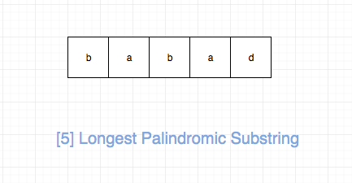
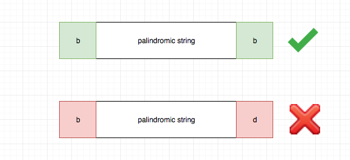
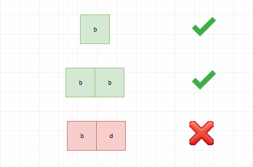

## 题目地址

https://leetcode.com/problems/longest-palindromic-substring/description/

## 题目描述

```
Given a string s, find the longest palindromic substring in s. You may assume that the maximum length of s is 1000.

Example 1:

Input: "babad"
Output: "bab"
Note: "aba" is also a valid answer.
Example 2:

Input: "cbbd"
Output: "bb"
```

## 思路

这是一道最长回文的题目，要我们求出给定字符串的最大回文子串。



解决这类问题的核心思想就是两个字“延伸”，具体来说

- 如果一个字符串是回文串，那么在它左右分别加上一个相同的字符，那么它一定还是一个回文串
- 如果一个字符串不是回文串，或者在回文串左右分别加不同的字符，得到的一定不是回文串

事实上，上面的分析已经建立了大问题和小问题之间的关联，
基于此，我们可以建立动态规划模型。

我们可以用 dp[i][j] 表示 s 中从 i 到 j（包括 i 和 j）是否可以形成回文，
状态转移方程只是将上面的描述转化为代码即可：

```js
if (s[i] === s[j] && dp[i + 1][j - 1]) {
  dp[i][j] = true;
}
```


base case就是一个字符（轴对称点是本身），或者两个字符（轴对称点是介于两者之间的虚拟点）。


## 关键点

- ”延伸“（extend）

## 代码

```js
/*
 * @lc app=leetcode id=5 lang=javascript
 *
 * [5] Longest Palindromic Substring
 */
/**
 * @param {string} s
 * @return {string}
 */
var longestPalindrome = function(s) {
  // babad
  // tag : dp
  if (!s || s.length === 0) return "";
  let res = s[0];

  const dp = [];

  // 倒着遍历简化操作， 这么做的原因是dp[i][..]依赖于dp[i + 1][..]
  for (let i = s.length - 1; i >= 0; i--) {
    dp[i] = [];
    for (let j = i; j < s.length; j++) {
      if (j - i === 0) dp[i][j] = true;
      // specail case 1
      else if (j - i === 1 && s[i] === s[j]) dp[i][j] = true;
      // specail case 2
      else if (s[i] === s[j] && dp[i + 1][j - 1]) {
        // state transition
        dp[i][j] = true;
      }

      if (dp[i][j] && j - i + 1 > res.length) {
        // update res
        res = s.slice(i, j + 1);
      }
    }
  }

  return res;
};
```

## 相关题目

- [516.longest-palindromic-subsequence](./516.longest-palindromic-subsequence.md)
