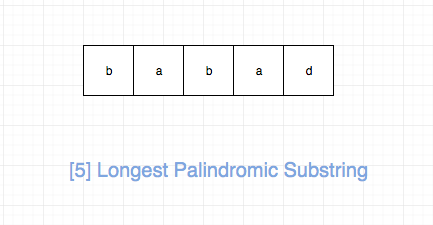

## 题目地址（5. 最长回文子串）

https://leetcode-cn.com/problems/longest-palindromic-substring/

## 题目描述

给定一个字符串 s，找到 s 中最长的回文子串。你可以假设  s 的最大长度为 1000。

示例 1：

输入: "babad"
输出: "bab"
注意: "aba" 也是一个有效答案。
示例 2：

输入: "cbbd"
输出: "bb"

## 前置知识

- 回文

## 思路

这是一道最长回文的题目，要我们求出给定字符串的最大回文子串。



解决这类问题的核心思想就是两个字“延伸”，具体来说

- 如果在一个不是回文字符串的字符串两端添加任何字符，或者在回文串左右分别加不同的字符，得到的一定不是回文串
- 如果一个字符串不是回文串，或者在回文串左右分别加不同的字符，得到的一定不是回文串

事实上，上面的分析已经建立了大问题和小问题之间的关联，
基于此，我们可以建立动态规划模型。

我们可以用 dp[i][j] 表示 s 中从 i 到 j（包括 i 和 j）是否可以形成回文，
状态转移方程只是将上面的描述转化为代码即可：

```js
if (s[i] === s[j] && dp[i + 1][j - 1]) {
  dp[i][j] = true;
}
```


base case 就是一个字符（轴对称点是本身），或者两个字符（轴对称点是介于两者之间的虚拟点）。


## 关键点

- ”延伸“（extend）

## 代码

代码支持：Python，JavaScript：

Python Code：

```python
class Solution:
    def longestPalindrome(self, s: str) -> str:
        n = len(s)
        if n == 0:
            return ""
        res = s[0]
        def extend(i, j, s):
            while(i >= 0 and j < len(s) and s[i] == s[j]):
                i -= 1
                j += 1
            return s[i + 1:j]

        for i in range(n - 1):
            e1 = extend(i, i, s)
            e2 = extend(i, i + 1, s)
            if max(len(e1), len(e2)) > len(res):
                res = e1 if len(e1) > len(e2) else e2
        return res
```

JavaScript Code：

```js
/*
 * @lc app=leetcode id=5 lang=javascript
 *
 * [5] Longest Palindromic Substring
 */
/**
 * @param {string} s
 * @return {string}
 */
var longestPalindrome = function (s) {
  // babad
  // tag : dp
  if (!s || s.length === 0) return "";
  let res = s[0];

  const dp = [];

  // 倒着遍历简化操作， 这么做的原因是dp[i][..]依赖于dp[i + 1][..]
  for (let i = s.length - 1; i >= 0; i--) {
    dp[i] = [];
    for (let j = i; j < s.length; j++) {
      if (j - i === 0) dp[i][j] = true;
      // specail case 1
      else if (j - i === 1 && s[i] === s[j]) dp[i][j] = true;
      // specail case 2
      else if (s[i] === s[j] && dp[i + 1][j - 1]) {
        // state transition
        dp[i][j] = true;
      }

      if (dp[i][j] && j - i + 1 > res.length) {
        // update res
        res = s.slice(i, j + 1);
      }
    }
  }

  return res;
};
```

**_复杂度分析_**

- 时间复杂度：$O(N^2)$
- 空间复杂度：$O(N^2)$

更多题解可以访问我的 LeetCode 题解仓库：https://github.com/azl397985856/leetcode 。 目前已经 30K star 啦。

大家也可以关注我的公众号《脑洞前端》获取更多更新鲜的 LeetCode 题解


## 相关题目

- [516.longest-palindromic-subsequence](./516.longest-palindromic-subsequence.md)
