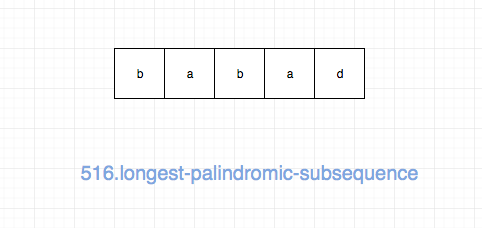
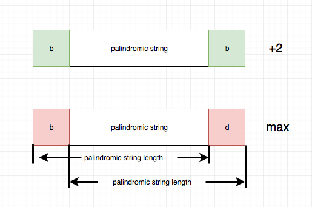

## 题目地址

https://leetcode.com/problems/longest-palindromic-subsequence/description/

## 题目描述

```
Given a string s, find the longest palindromic subsequence's length in s. You may assume that the maximum length of s is 1000.

Example 1:
Input:

"bbbab"
Output:
4
One possible longest palindromic subsequence is "bbbb".
Example 2:
Input:

"cbbd"
Output:
2
One possible longest palindromic subsequence is "bb".
```

## 前置知识

- 动态规划

## 思路

这是一道最长回文的题目，要我们求出给定字符串的最大回文子序列。



解决这类问题的核心思想就是两个字“延伸”，具体来说

- 如果一个字符串是回文串，那么在它左右分别加上一个相同的字符，那么它一定还是一个回文串，因此`回文长度增加2`
- 如果一个字符串不是回文串，或者在回文串左右分别加不同的字符，得到的一定不是回文串,因此`回文长度不变，我们取[i][j-1]和[i+1][j]的较大值`



事实上，上面的分析已经建立了大问题和小问题之间的关联，
基于此，我们可以建立动态规划模型。

我们可以用 dp[i][j] 表示 s 中从 i 到 j（包括 i 和 j）的回文序列长度，
状态转移方程只是将上面的描述转化为代码即可：

```js
if (s[i] === s[j]) {
  dp[i][j] = dp[i + 1][j - 1] + 2;
} else {
  dp[i][j] = Math.max(dp[i][j - 1], dp[i + 1][j]);
}
```

base case 就是一个字符（轴对称点是本身）


## 关键点

- ”延伸“（extend）

## 代码

```js
/*
 * @lc app=leetcode id=516 lang=javascript
 *
 * [516] Longest Palindromic Subsequence
 */
/**
 * @param {string} s
 * @return {number}
 */
var longestPalindromeSubseq = function(s) {
  // bbbab 返回4
  // tag : dp
  const dp = [];

  for (let i = s.length - 1; i >= 0; i--) {
    dp[i] = Array(s.length).fill(0);
    for (let j = i; j < s.length; j++) {
      if (i - j === 0) dp[i][j] = 1;
      else if (s[i] === s[j]) {
        dp[i][j] = dp[i + 1][j - 1] + 2;
      } else {
        dp[i][j] = Math.max(dp[i][j - 1], dp[i + 1][j]);
      }
    }
  }

  return dp[0][s.length - 1];
};
```

## 相关题目

- [5.longest-palindromic-substring](./5.longest-palindromic-substring.md)
