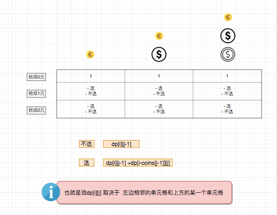
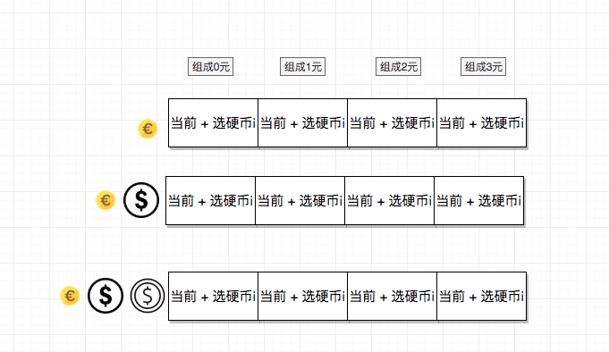
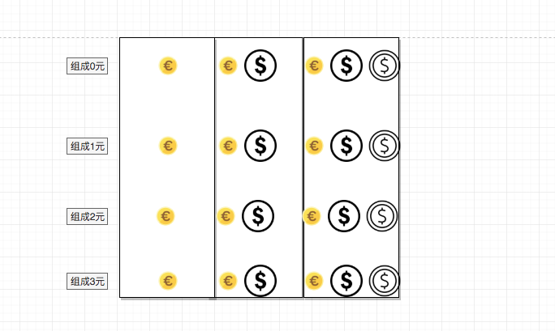

## 题目地址
https://leetcode.com/problems/coin-change-2/description/

## 题目描述
```
You are given coins of different denominations and a total amount of money. Write a function to compute the number of combinations that make up that amount. You may assume that you have infinite number of each kind of coin.

 

Example 1:

Input: amount = 5, coins = [1, 2, 5]
Output: 4
Explanation: there are four ways to make up the amount:
5=5
5=2+2+1
5=2+1+1+1
5=1+1+1+1+1
Example 2:

Input: amount = 3, coins = [2]
Output: 0
Explanation: the amount of 3 cannot be made up just with coins of 2.
Example 3:

Input: amount = 10, coins = [10] 
Output: 1
 

Note:

You can assume that

0 <= amount <= 5000
1 <= coin <= 5000
the number of coins is less than 500
the answer is guaranteed to fit into signed 32-bit integer

```
## 思路
这个题目和coin-change的思路比较类似。

我们还是按照coin-change的思路来， 如果将问题画出来大概是这样：




进一步我们可以对问题进行空间复杂度上的优化（这种写法比较难以理解，但是相对更省空间）



> 这里用动图会更好理解， 有时间的话我会做一个动图出来， 现在大家脑补一下吧

## 关键点解析

- 动态规划

- 子问题

用dp[i] 来表示组成i块钱，需要最少的硬币数，那么

1. 第j个硬币我可以选择不拿       这个时候， 组成数 =  dp[i]

2. 第j个硬币我可以选择拿     这个时候， 组成数 =  dp[i - coins[j]] + dp[i]

- 和背包问题不同， 硬币是可以拿任意个

- 对于每一个 dp[i] 我们都选择遍历一遍 coin， 不断更新 dp[i]

eg: 

```js
   if (amount === 0) return 1;

    const dp = [Array(amount + 1).fill(1)];

    for (let i = 1; i < amount + 1; i++) {
      dp[i] = Array(coins.length + 1).fill(0);
      for (let j = 1; j < coins.length + 1; j++) { // 从1开始可以简化运算
        if (i - coins[j - 1] >= 0 ) { // 注意这里是coins[j -1]而不是coins[j]
          dp[i][j] = dp[i][j - 1] + dp[i - coins[j - 1]][j]; // 由于可以重复使用硬币所以这里是j不是j-1
        } else {
          dp[i][j] = dp[i][j - 1];
        }
      }
    }

    return dp[dp.length - 1][coins.length];

```


- 当我们选择一维数组去解的时候，内外循环将会对结果造成影响



eg:

```js
  // 这种答案是不对的。
  // 原因在于比如amount = 5, coins = [1,2,5]
  // 这种算法会将[1,2,2] [2,1,2] [2, 2, 1] 算成不同的

    if (amount === 0) return 1;

    const dp = [1].concat(Array(amount).fill(0));

    for (let i = 1; i < amount + 1; i++) {
      for (let j = 0; j < coins.length; j++) {
        if (i - coins[j] >= 0) {
          dp[i] = dp[i] + dp[i - coins[j]];
        }
      }
    }

    return dp[dp.length - 1];

  // 正确的写法应该是内外循环调换一下, 具体可以看下方代码区

```

## 代码
```js
/*
 * @lc app=leetcode id=518 lang=javascript
 *
 * [518] Coin Change 2
 *
 * https://leetcode.com/problems/coin-change-2/description/
 *
 * algorithms
 * Medium (41.57%)
 * Total Accepted:    39.7K
 * Total Submissions: 94.6K
 * Testcase Example:  '5\n[1,2,5]'
 *
 * You are given coins of different denominations and a total amount of money.
 * Write a function to compute the number of combinations that make up that
 * amount. You may assume that you have infinite number of each kind of
 * coin.
 *
 *
 *
 *
 *
 *
 * Example 1:
 *
 *
 * Input: amount = 5, coins = [1, 2, 5]
 * Output: 4
 * Explanation: there are four ways to make up the amount:
 * 5=5
 * 5=2+2+1
 * 5=2+1+1+1
 * 5=1+1+1+1+1
 *
 *
 * Example 2:
 *
 *
 * Input: amount = 3, coins = [2]
 * Output: 0
 * Explanation: the amount of 3 cannot be made up just with coins of 2.
 *
 *
 * Example 3:
 *
 *
 * Input: amount = 10, coins = [10]
 * Output: 1
 *
 *
 *
 *
 * Note:
 *
 * You can assume that
 *
 *
 * 0 <= amount <= 5000
 * 1 <= coin <= 5000
 * the number of coins is less than 500
 * the answer is guaranteed to fit into signed 32-bit integer
 *
 *
 */
/**
 * @param {number} amount
 * @param {number[]} coins
 * @return {number}
 */
var change = function(amount, coins) {
  if (amount === 0) return 1;

  const dp = [1].concat(Array(amount).fill(0));

  for (let j = 0; j < coins.length; j++) {
    for (let i = 1; i < amount + 1; i++) {
      if (i - coins[j] >= 0) {
        dp[i] = dp[i] + dp[i - coins[j]];
      }
    }
  }

  return dp[dp.length - 1];
};
```

## 扩展

这是一道很简单描述的题目， 因此很多时候会被用到大公司的电面中。

相似问题:

[322.coin-change](./322.coin-change.md)


