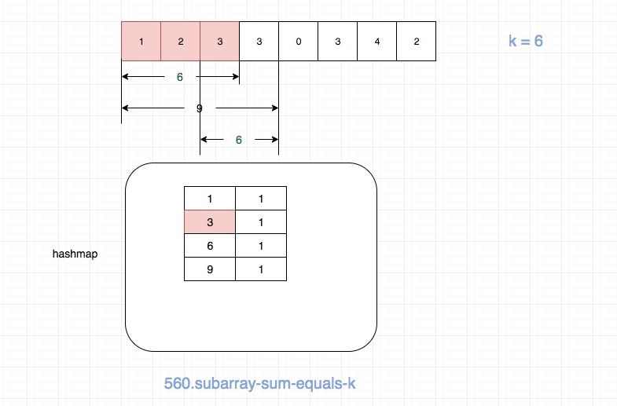

## Problem

https://leetcode.com/problems/subarray-sum-equals-k/description/

## Problem Description

```
Given an array of integers and an integer k, you need to find the total number of continuous subarrays whose sum equals to k.

Example 1:
Input:nums = [1,1,1], k = 2
Output: 2
Note:
The length of the array is in range [1, 20,000].
The range of numbers in the array is [-1000, 1000] and the range of the integer k is [-1e7, 1e7].
```

## Solution

The simplest method is `Brute-force`. Consider every possible subarray, find the sum of the elements of each of those subarrays and check for the equality of the sum with `k`. Whenever the sum equals `k`, we increment the `count`. Time Complexity is O(n^2). Implementation is as followed.

```py
class Solution:
    def subarraySum(self, nums: List[int], k: int) -> int:
        cnt, n =  0, len(nums)
        for i in range(n):
            for j in range(i, n):
                if (sum(nums[i:j + 1]) == k): cnt += 1
        return cnt
```

If we implement the `sum()` method on our own, we get the time of complexity O(n^3).

```py
class Solution:
    def subarraySum(self, nums: List[int], k: int) -> int:
        cnt, n =  0, len(nums)
        for i in range(n):
            for j in range(i, n):
                sum = 0
                for x in range(i, j + 1):
                  sum += nums[x]
                if (sum == k): cnt += 1
        return cnt
```

At first glance I think "maybe it can be solved by using the sliding window technique". However, I give that thought up when I find out that the given array may contain negative numbers, which makes it more complicated to expand or narrow the range of the sliding window. Then I think about using a prefix sum array, with which we can obtain the sum of the elements between every two indices by subtracting the prefix sum corresponding to the two indices. It sounds feasible, so I implement it as followed.

```py
class Solution:
    def subarraySum(self, nums: List[int], k: int) -> int:
      cnt, n =  0, len(nums)
      pre = [0] * (n + 1)
      for i in range(1, n + 1):
          pre[i] = pre[i - 1] + nums[i - 1]
      for i in range(1, n + 1):
          for j in range(i, n + 1):
              if (pre[j] - pre[i - 1] == k): cnt += 1
      return cnt
```

Actually, there is a more clever way to do this. Instead of using a prefix sum array, we use a hashmap to reduce the time complexity to O(n).

Algorithm:

- We make use of a hashmap to store the cumulative sum `acc` and the number of times the same sum occurs. We use `acc` as the `key` of the hashmap and the number of times the same `acc` occurs as the `value`.

- We traverse over the given array and keep on finding the cumulative sum `acc`. Every time we encounter a new `acc` we add a new entry to the hashmap. If the same `acc` occurs, we increment the count corresponding to that `acc` in the hashmap. If `acc` equals `k`, obviously `count` should be incremented. If `acc - k` got, we should increment `account` by `hashmap[acc - k]`.

- The idea behind this is that if the cumulative sum upto two indices is the same, the sum of the elements between those two indices is zero. So if the cumulative sum upto two indices is at a different of `k`, the sum of the elements between those indices is `k`. As `hashmap[acc - k]` keeps track of the number of times a subarray with sum `acc - k` has occured upto the current index, by doing a simple substraction `acc - (acc - k)` we can see that `hashmap[acc - k]` actually also determines the number of times a subarray with sum `k` has occured upto the current index. So we increment the `count` by `hashmap[acc - k]`.

Here is a graph demonstrating this algorithm in the case of `nums = [1,2,3,3,0,3,4,2], k = 6`.



When we are at `nums[3]`, the hashmap is as the picture shows, and `count` is 2 by this time. `[1, 2, 3]` accounts for one of the count, and `[3, 3]` accounts for another.

The subarray `[3, 3]` is obtained from `hashmap[acc - k]`, which is `hashmap[9 - 6]`.

## Key Points

- Prefix sum array
- Make use of a hashmap to track cumulative sum and avoid repetitive calculation.

## Code (`JavaScript/Python`)

*JavaScript Code*
```js
/*
 * @lc app=leetcode id=560 lang=javascript
 *
 * [560] Subarray Sum Equals K
 */
/**
 * @param {number[]} nums
 * @param {number} k
 * @return {number}
 */
var subarraySum = function (nums, k) {
  const hashmap = {};
  let acc = 0;
  let count = 0;

  for (let i = 0; i < nums.length; i++) {
    acc += nums[i];

    if (acc === k) count++;

    if (hashmap[acc - k] !== void 0) {
      count += hashmap[acc - k];
    }

    if (hashmap[acc] === void 0) {
      hashmap[acc] = 1;
    } else {
      hashmap[acc] += 1;
    }
  }

  return count;
};
```

*Python Cose*

```py
class Solution:
    def subarraySum(self, nums: List[int], k: int) -> int:
        d = {}
        acc = count = 0
        for num in nums:
            acc += num
            if acc == k:
                count += 1
            if acc - k in d:
                count += d[acc-k]
            if acc in d:
                d[acc] += 1
            else:
                d[acc] = 1
        return count
```

## Extension

There is a similar but a bit more complicated problem. Link to the problem: [437.path-sum-iii](https://github.com/azl397985856/leetcode/blob/master/problems/437.path-sum-iii.md)(Chinese).
