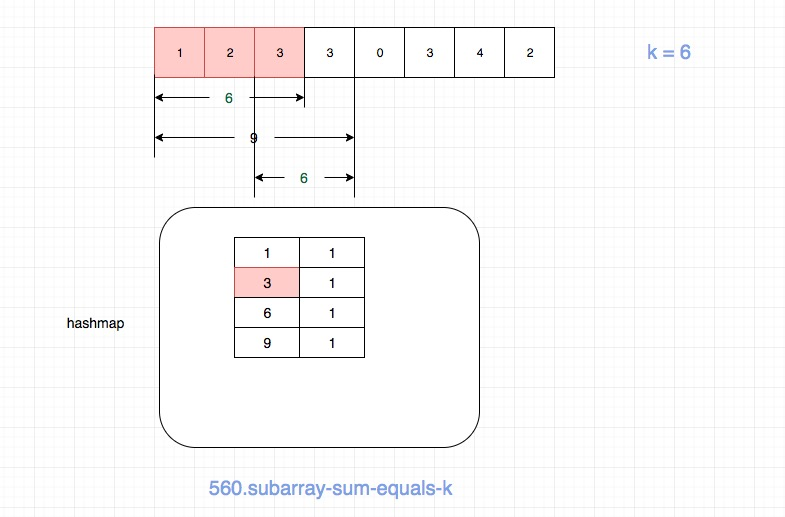

## 题目地址
https://leetcode.com/problems/subarray-sum-equals-k/description/

## 题目描述
```
Given an array of integers and an integer k, you need to find the total number of continuous subarrays whose sum equals to k.

Example 1:
Input:nums = [1,1,1], k = 2
Output: 2
Note:
The length of the array is in range [1, 20,000].
The range of numbers in the array is [-1000, 1000] and the range of the integer k is [-1e7, 1e7].

```
## 思路
符合直觉的做法是暴力求解所有的子数组，然后分别计算和，如果等于k,count就+1.这种做法的时间复杂度为O(n^2).

这里有一种更加巧妙的方法，我们可以借助额外的空间，使用hashmap来简化时间复杂度，这种算法的时间复杂度可以达到O(n).

我们维护一个hashmap，hashmap的key为累加值acc，value为累加值acc出现的次数。
我们迭代数组，然后不断更新acc和hashmap，如果acc 等于k，那么很明显应该+1. 如果hashmap[acc - k] 存在，
我们就把它加到结果中去即可。

语言比较难以解释，我画了一个图来演示nums = [1,2,3,3,0,3,4,2], k = 6的情况。



如图，当访问到nums[3]的时候，hashmap如图所示，这个时候count为2.
其中之一是[1,2,3],这个好理解。还有一个是[3,3].

这个[3,3]正是我们通过hashmap[acc - k]即hashmap[9 - 6]得到的。

## 关键点解析

- 可以利用hashmap记录和的累加值来避免重复计算

## 代码
```js
/*
 * @lc app=leetcode id=560 lang=javascript
 *
 * [560] Subarray Sum Equals K
 */
/**
 * @param {number[]} nums
 * @param {number} k
 * @return {number}
 */
var subarraySum = function(nums, k) {
  const hashmap = {};
  let acc = 0;
  let count = 0;
  
  for (let i = 0; i < nums.length; i++) {
    acc += nums[i];

    if (acc === k) count++;

    if (hashmap[acc - k] !== void 0) {
      count += hashmap[acc - k];
    }

    if (hashmap[acc] === void 0) {
      hashmap[acc] = 1;
    } else {
      hashmap[acc] += 1;
    }
  }

  return count;
};
```

## 扩展

这是一道类似的题目，但是会稍微复杂一点, 题目地址: [437.path-sum-iii](./437.path-sum-iii.md)


