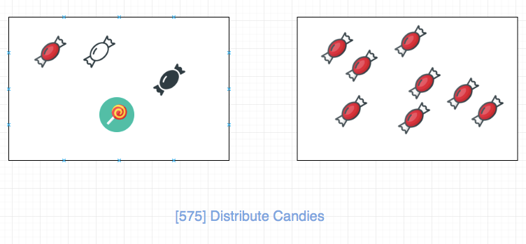

## 题目地址
https://leetcode.com/problems/distribute-candies/description/

## 题目描述

```
Given an integer array with even length, where different numbers in this array represent different kinds of candies. Each number means one candy of the corresponding kind. You need to distribute these candies equally in number to brother and sister. Return the maximum number of kinds of candies the sister could gain.
Example 1:
Input: candies = [1,1,2,2,3,3]
Output: 3
Explanation:
There are three different kinds of candies (1, 2 and 3), and two candies for each kind.
Optimal distribution: The sister has candies [1,2,3] and the brother has candies [1,2,3], too.
The sister has three different kinds of candies.
Example 2:
Input: candies = [1,1,2,3]
Output: 2
Explanation: For example, the sister has candies [2,3] and the brother has candies [1,1].
The sister has two different kinds of candies, the brother has only one kind of candies.
Note:

The length of the given array is in range [2, 10,000], and will be even.
The number in given array is in range [-100,000, 100,000].
```

## 前置知识

- 数组

## 思路
由于糖果是偶数，并且我们只需要做到两个人糖果数量一样即可。

考虑两种情况:



- 如果糖果种类大于n / 2（糖果种类数为n），妹妹最多可以获得的糖果种类应该是`n / 2`(因为妹妹只有n / 2个糖).
- 糖果种类数小于n / 2, 妹妹能够得到的糖果种类可以是糖果的种类数（糖果种类本身就这么多）.

因此我们发现，妹妹能够获得的糖果种类的制约因素其实是糖果种类数。

## 关键点解析

- 这是一道逻辑题目，因此如果逻辑分析清楚了，代码是自然而然的


## 代码

* 语言支持：JS, Python

Javascript Code:

```js
/*
 * @lc app=leetcode id=575 lang=javascript
 *
 * [575] Distribute Candies
 */
/**
 * @param {number[]} candies
 * @return {number}
 */
var distributeCandies = function(candies) {
    const count = new Set(candies);
    return Math.min(count.size, candies.length >> 1);
};
```

Python Code:

```python
class Solution:
    def distributeCandies(self, candies: List[int]) -> int:
        return min(len(set(candies)), len(candies) >> 1)
```
