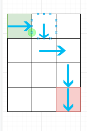
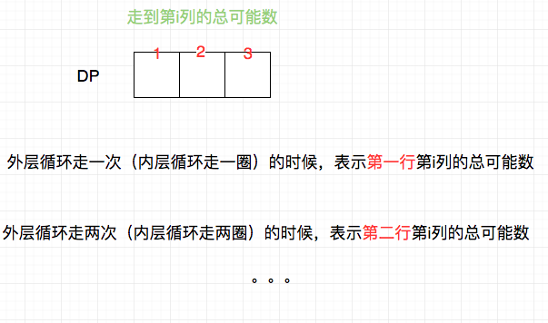

## 题目地址
https://leetcode.com/problems/unique-paths/description/

## 题目描述
```

A robot is located at the top-left corner of a m x n grid (marked 'Start' in the diagram below).

The robot can only move either down or right at any point in time. The robot is trying to reach the bottom-right corner of the grid (marked 'Finish' in the diagram below).

How many possible unique paths are there?
```


```
Above is a 7 x 3 grid. How many possible unique paths are there?

Note: m and n will be at most 100.

Example 1:

Input: m = 3, n = 2
Output: 3
Explanation:
From the top-left corner, there are a total of 3 ways to reach the bottom-right corner:
1. Right -> Right -> Down
2. Right -> Down -> Right
3. Down -> Right -> Right
Example 2:

Input: m = 7, n = 3
Output: 28
```

## 思路
这是一道典型的适合使用动态规划解决的题目，它和爬楼梯等都属于动态规划中最简单的题目，
因此也经常会被用于面试之中。

读完题目你就能想到动态规划的话，建立模型并解决恐怕不是难事。其实我们很容易看出，由于机器人只能右移动和下移动，
因此第[i, j]个格子的总数应该等于[i - 1, j] + [i, j -1]， 因为第[i,j]个格子一定是从左边或者上面移动过来的。



代码大概是：

```js
 const dp = [];
  for (let i = 0; i < m + 1; i++) {
    dp[i] = [];
    dp[i][0] = 0;
  }
  for (let i = 0; i < n + 1; i++) {
    dp[0][i] = 0;
  }
  for (let i = 1; i < m + 1; i++) {
    for(let j = 1; j < n + 1; j++) {
        dp[i][j] = j === 1 ? 1 : dp[i - 1][j] + dp[i][j - 1]; // 转移方程
    }
  }

  return dp[m][n];

```

由于dp[i][j] 只依赖于左边的元素和上面的元素，因此空间复杂度可以进一步优化， 优化到O(n).



具体代码请查看代码区。

## 关键点

- 空间复杂度可以进一步优化到O(n), 这会是一个考点
- 基本动态规划问题
## 代码

```js
/*
 * @lc app=leetcode id=62 lang=javascript
 *
 * [62] Unique Paths
 *
 * https://leetcode.com/problems/unique-paths/description/
 *
 * algorithms
 * Medium (46.53%)
 * Total Accepted:    277K
 * Total Submissions: 587.7K
 * Testcase Example:  '3\n2'
 *
 * A robot is located at the top-left corner of a m x n grid (marked 'Start' in
 * the diagram below).
 *
 * The robot can only move either down or right at any point in time. The robot
 * is trying to reach the bottom-right corner of the grid (marked 'Finish' in
 * the diagram below).
 *
 * How many possible unique paths are there?
 *
 *
 * Above is a 7 x 3 grid. How many possible unique paths are there?
 *
 * Note: m and n will be at most 100.
 *
 * Example 1:
 *
 *
 * Input: m = 3, n = 2
 * Output: 3
 * Explanation:
 * From the top-left corner, there are a total of 3 ways to reach the
 * bottom-right corner:
 * 1. Right -> Right -> Down
 * 2. Right -> Down -> Right
 * 3. Down -> Right -> Right
 *
 *
 * Example 2:
 *
 *
 * Input: m = 7, n = 3
 * Output: 28
 *
 *   START
 */
/**
 * @param {number} m
 * @param {number} n
 * @return {number}
 */
var uniquePaths = function(m, n) {
  const dp = Array(n).fill(1);
  
  for(let i = 1; i < m; i++) {
    for(let j = 1; j < n; j++) {
      dp[j] = dp[j] + dp[j - 1];
    } 
  }

  return dp[n - 1];
};
```
