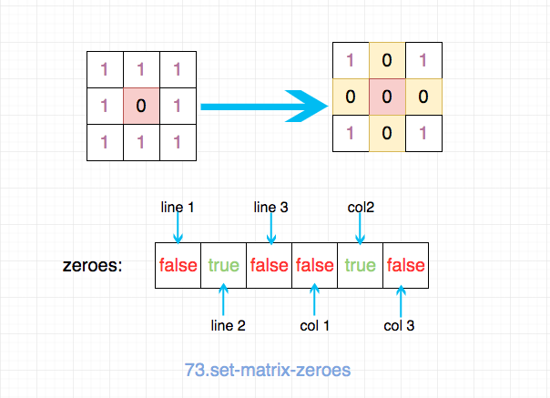
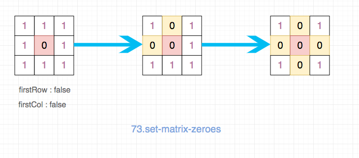

## 题目地址

https://leetcode.com/problems/set-matrix-zeroes/description/

## 题目描述

```
Given a m x n matrix, if an element is 0, set its entire row and column to 0. Do it in-place.

Example 1:

Input:
[
  [1,1,1],
  [1,0,1],
  [1,1,1]
]
Output:
[
  [1,0,1],
  [0,0,0],
  [1,0,1]
]
Example 2:

Input:
[
  [0,1,2,0],
  [3,4,5,2],
  [1,3,1,5]
]
Output:
[
  [0,0,0,0],
  [0,4,5,0],
  [0,3,1,0]
]
Follow up:

- A straight forward solution using O(mn) space is probably a bad idea.
- A simple improvement uses O(m + n) space, but still not the best solution.
- Could you devise a constant space solution?

```

## 思路

符合直觉的想法是，使用一个 m + n 的数组来表示每一行每一列是否”全部是 0“，
先遍历一遍去构建这样的 m + n 数组，然后根据这个 m + n 数组去修改 matrix 即可。



这样的时间复杂度 O(m \* n), 空间复杂度 O(m + n).

代码如下：

```js
var setZeroes = function(matrix) {
  if (matrix.length === 0) return matrix;
  const m = matrix.length;
  const n = matrix[0].length;
  const zeroes = Array(m + n).fill(false);

  for (let i = 0; i < m; i++) {
    for (let j = 0; j < n; j++) {
      const item = matrix[i][j];

      if (item === 0) {
        zeroes[i] = true;
        zeroes[m + j] = true;
      }
    }
  }

  for (let i = 0; i < m; i++) {
    if (zeroes[i]) {
      matrix[i] = Array(n).fill(0);
    }
  }

  for (let i = 0; i < n; i++) {
    if (zeroes[m + i]) {
      for (let j = 0; j < m; j++) {
        matrix[j][i] = 0;
      }
    }
  }

  return matrix;
};
```

但是这道题目还有一个follow up， 要求使用O(1)的时间复杂度。因此上述的方法就不行了。
但是我们要怎么去存取这些信息（哪一行哪一列应该全部为0）呢？

一种思路是使用第一行第一列的数据来代替上述的zeros数组。 这样我们就不必借助额外的存储空间，空间复杂度自然就是O(1)了。

由于我们不能先操作第一行和第一列， 因此我们需要记录下”第一行和第一列是否全是0“这样的一个数据，最后根据这个信息去
修改第一行和第一列。

具体步骤如下：

- 记录下”第一行和第一列是否全是0“这样的一个数据
- 遍历除了第一行和第一列之外的所有的数据，如果是0，那就更新第一行第一列中对应的元素为0
> 你可以把第一行第一列看成我们上面那种解法使用的m + n 数组。
- 根据第一行第一列的数据，更新matrix
- 最后根据我们最开始记录的”第一行和第一列是否全是0“去更新第一行和第一列即可




## 关键点
- 使用第一行和第一列来替代我们m  + n 数组
- 先记录下”第一行和第一列是否全是0“这样的一个数据，否则会因为后续对第一行第一列的更新造成数据丢失
- 最后更新第一行第一列
## 代码

```js
/*
 * @lc app=leetcode id=73 lang=javascript
 *
 * [73] Set Matrix Zeroes
 */
/**
 * @param {number[][]} matrix
 * @return {void} Do not return anything, modify matrix in-place instead.
 */
var setZeroes = function(matrix) {
  if (matrix.length === 0) return matrix;
  const m = matrix.length;
  const n = matrix[0].length;

  // 时间复杂度 O(m * n), 空间复杂度 O(1)
  let firstRow = false; // 第一行是否应该全部为0
  let firstCol = false; // 第一列是否应该全部为0

  for (let i = 0; i < m; i++) {
    for (let j = 0; j < n; j++) {
      const item = matrix[i][j];
      if (item === 0) {
        if (i === 0) {
          firstRow = true;
        }
        if (j === 0) {
          firstCol = true;
        }
        matrix[0][j] = 0;
        matrix[i][0] = 0;
      }
    }
  }

  for (let i = 1; i < m; i++) {
    for (let j = 1; j < n; j++) {
      const item = matrix[i][j];
      if (matrix[0][j] == 0 || matrix[i][0] == 0) {
        matrix[i][j] = 0;
      }
    }
  }

  // 最后处理第一行和第一列

  if (firstRow) {
    for (let i = 0; i < n; i++) {
      matrix[0][i] = 0;
    }
  }

  if (firstCol) {
    for (let i = 0; i < m; i++) {
      matrix[i][0] = 0;
    }
  }

  return matrix;
};
```

## 扩展

为什么选择第一行第一列，选择其他行和列可以么？为什么？
