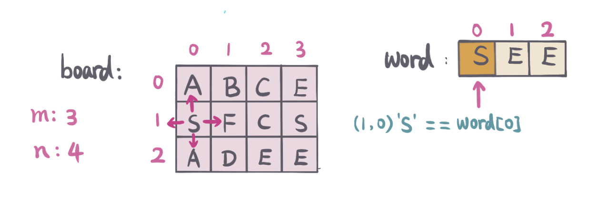
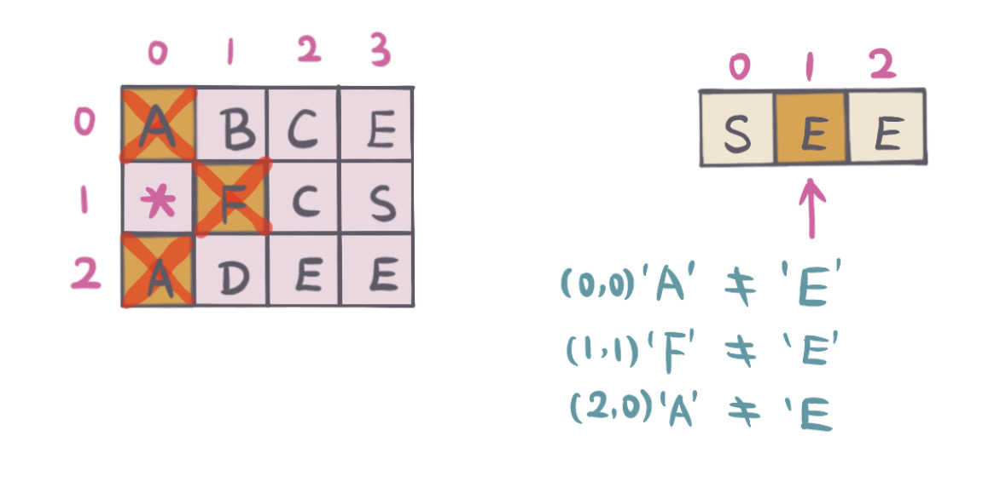
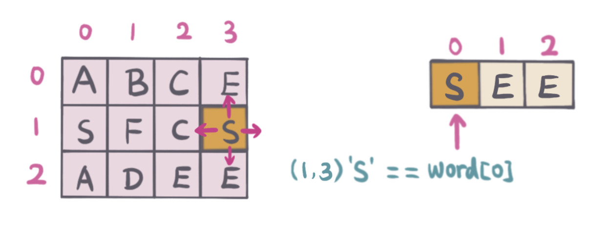
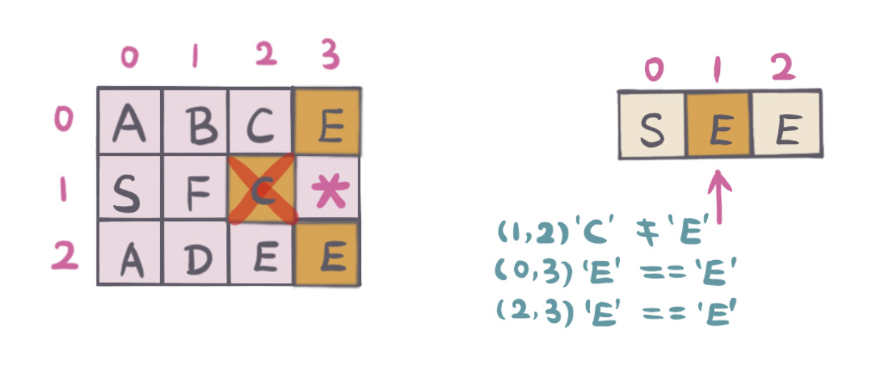
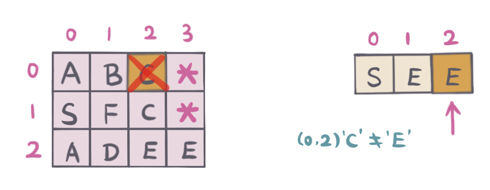
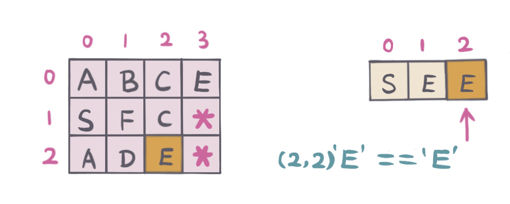
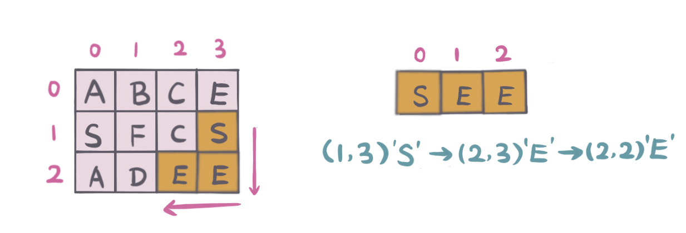

## Problem
https://leetcode.com/problems/word-search/

## Problem Description
```
Given a 2D board and a word, find if the word exists in the grid.

The word can be constructed from letters of sequentially adjacent cell, where "adjacent" cells are those horizontally or vertically neighboring. The same letter cell may not be used more than once.

Example:

board =
[
  ['A','B','C','E'],
  ['S','F','C','S'],
  ['A','D','E','E']
]

Given word = "ABCCED", return true.
Given word = "SEE", return true.
Given word = "ABCB", return false.
```

## Solution

This problem does not give start position, or direction restriction, so 
1. Scan board, find starting position with matching word first letter
2. From starting position, DFS (4 (up, down, left, right 4 directions) match word's rest letters
3. For each visited letter, mark it as visited, here use `board[i][j] = '*'` to represent visited.
4. If one direction cannot continue, backtracking, mark start position unvisited, mark `board[i][j] = word[start]`
5. If found any matching, terminate
6. Otherwise, no matching found, return false. 

For example: 

board, word：`SEE` as below pic:
```
1. Scan board, found board[1,0] = word[0]，match word first letter。
2. DFS（up, down, left, right 4 directions）

as below pic:
```


Staring position（1，0), check whether adjacent cells match word next letter `E`.
```
1. mark current position（1，0）as visited，board[1][0] = '*'
2. Up（0，0）letter='A' not match, 
3. Down（2，0）letter='A'，not match,
4. Left（-1，0）out of board boundry，not match,
5. right（1，1）letter='F'，not match

as below pic:
```


Didn't find matching from starting position, so
```
1. backtracking，mart start position（1，0）as unvisited, board[1][0] = 'S'. 
2. scan board, find next start position（1，3）which match word first letter

as below pic:
```


New starting position（1，3），check whether adjacent cells match word next letter `E`.
```
1. mark current position（1, 3）as already visited，board[1][3] = '*'
2. Up（0，3）letter='E', match, continue DFS search，refer position（0，3）DFS search steps.
3. Down（2，3）letter='E'，match, since #2 DFS didn't find word matching, continue DFS search, rfer to position (2, 3) DFS search steps.
4. Left（1，2）letter='C'，not match,
5. Right（1，4）out of board boundry，not match

as below pic:
```


Start position（0，3), DFS，check whether adjacent cells match word next letter `E`
```
1. marck current position（0，3）already visited，board[0][3] = '*'
2. Up （-1，3）out of board boundry，not match
3. Down（1，3）already visited，
4. Left（0，2）letter='C'，not match
5. Right（1，4）out of board boundry，not match

as below pic:
```


Start from position（0，3）not matching word, start position (2, 3) DFS search:
```
1. Backtracking，mark（0，3）as unvisited。board[0][3] = 'E'. 
2. Backtracking to next position（2，3），DFS，check whether adjacent cells match word next letter 'E'
3. Up (1，3）visited, continue
4. Down（3，3）out of board boundry，not match
5. Left（2，2）letter='E', match
6. Right（2，4）out of board boundry，not match

as below pic:
```


Found match with word, return `True`.


#### Complexity Analysis
- *Time Complexity:* `O(m*n) - m is number of board rows, n is number of board columns `
- *Space Complexity:* `O(1) - no extra space`

>**Note**：if use Set or boolean[][] mark position visited，need extra space `O(m*n)`.

## Key Points

- Scan board, find start position which match word first letter, DFS
- Remember visited letter
- Backtracking if not found matching

## Code (`Java/Javascript/Python3`)
*Java Code*
```java
public class LC79WordSearch {
  public boolean exist(char[][] board, String word) {
    if (board == null || board.length == 0 || board[0].length == 0
        || word == null || word.length() == 0) return true;
    int rows = board.length;
    int cols = board[0].length;
    for (int r = 0; r < rows; r++) {
      for (int c = 0; c < cols; c++) {
        // scan board, start with word first character 
        if (board[r][c] == word.charAt(0)) {
          if (helper(board, word, r, c, 0)) {
            return true;
          }
        }
      }
    }
    return false;
  }
  
  private boolean helper(char[][] board, String word, int r, int c, int start) {
    // already match word all characters, return true
    if (start == word.length()) return true;
    if (!isValid(board, r, c) ||
        board[r][c] != word.charAt(start)) return false;
    // mark visited
    board[r][c] = '*';
    boolean res = helper(board, word, r + 1, c, start + 1)
        ||  helper(board, word, r, c + 1, start + 1)
        ||  helper(board, word, r - 1, c, start + 1)
        ||  helper(board, word, r, c - 1, start + 1);
    // backtracking to start position
    board[r][c] = word.charAt(start);
    return res;
  }
  
  private boolean isValid(char[][] board, int r, int c) {
    return r >= 0 && r < board.length && c >= 0 && c < board[0].length;
  }
}
```

*Python3 Code*
```python
class Solution:
    def exist(self, board: List[List[str]], word: str) -> bool:
        m = len(board)
        n = len(board[0])
        
        def dfs(board, r, c, word, index):
            if index == len(word):
                return True
            if r < 0 or r >= m or c < 0 or c >= n or board[r][c] != word[index]:
                return False
            board[r][c] = '*'
            res = dfs(board, r - 1, c, word, index + 1) or dfs(board, r + 1, c, word, index + 1) or dfs(board, r, c - 1, word, index + 1) or dfs(board, r, c + 1, word, index + 1)
            board[r][c] = word[index]
            return res
        
        for r in range(m):
            for c in range(n):
                if board[r][c] == word[0]:
                    if dfs(board, r, c, word, 0):
                        return True
```

*Javascript Code* from [**@lucifer**](https://github.com/azl397985856)
```javascript
/*
 * @lc app=leetcode id=79 lang=javascript
 *
 * [79] Word Search
 */
function DFS(board, row, col, rows, cols, word, cur) {
  // 边界检查
  if (row >= rows || row < 0) return false;
  if (col >= cols || col < 0) return false;

  const item = board[row][col];

  if (item !== word[cur]) return false;

  if (cur + 1 === word.length) return true;

  // If use HashMap keep track visited letters, then need manual clear HashMap for each backtrack which needs extra space.
  // here we use a little trick
  board[row][col] = null;

  // UP, DOWN, LEFT, RIGHT
  const res =
    DFS(board, row + 1, col, rows, cols, word, cur + 1) ||
    DFS(board, row - 1, col, rows, cols, word, cur + 1) ||
    DFS(board, row, col - 1, rows, cols, word, cur + 1) ||
    DFS(board, row, col + 1, rows, cols, word, cur + 1);

  board[row][col] = item;

  return res;
}
/**
 * @param {character[][]} board
 * @param {string} word
 * @return {boolean}
 */
var exist = function(board, word) {
  if (word.length === 0) return true;
  if (board.length === 0) return false;

  const rows = board.length;
  const cols = board[0].length;

  for (let i = 0; i < rows; i++) {
    for (let j = 0; j < cols; j++) {
      const hit = DFS(board, i, j, rows, cols, word, 0);
      if (hit) return true;
    }
  }
  return false;
};
```

## References
1. [Backtracking Wiki](https://www.wikiwand.com/en/Backtracking)