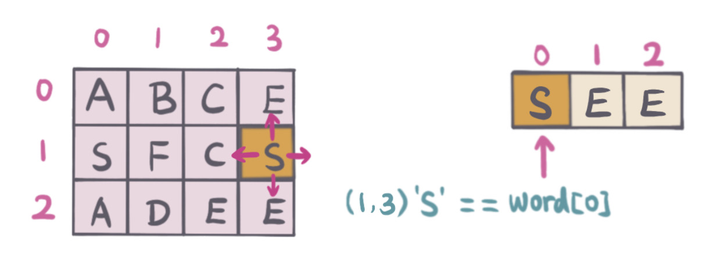
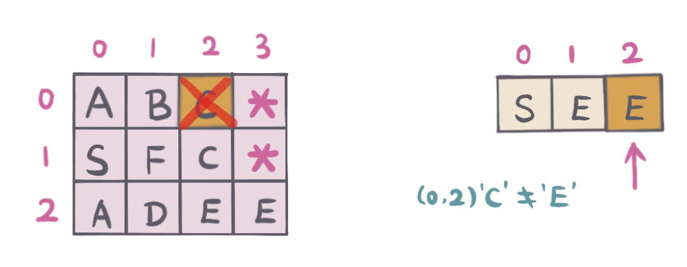
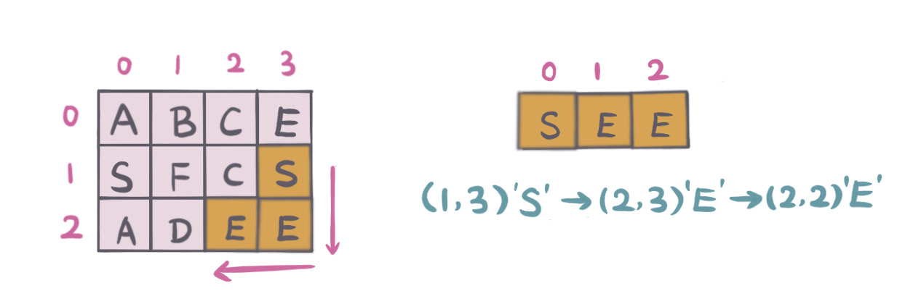

## 题目地址

https://leetcode.com/problems/word-search/

## 题目描述

```
Given a 2D board and a word, find if the word exists in the grid.

The word can be constructed from letters of sequentially adjacent cell, where "adjacent" cells are those horizontally or vertically neighboring. The same letter cell may not be used more than once.

Example:

board =
[
  ['A','B','C','E'],
  ['S','F','C','S'],
  ['A','D','E','E']
]

Given word = "ABCCED", return true.
Given word = "SEE", return true.
Given word = "ABCB", return false.
```

## 前置知识

- 回溯

## 思路

在 2D 表中搜索是否有满足给定单词的字符组合，要求所有字符都是相邻的（方向不限). 题中也没有要求字符的起始和结束位置。

在起始位置不确定的情况下，扫描二维数组，找到字符跟给定单词的第一个字符相同的，四个方向（上，下，左，右）分别 DFS 搜索，
如果任意方向满足条件，则返回结果。不满足，回溯，重新搜索。

举例说明：如图二维数组，单词："SEE"

```
1. 扫描二维数组，找到board[1,0] = word[0]，匹配单词首字母。
2. 做DFS（上，下，左，右 四个方向）

如下图：
```


起始位置（1，0），判断相邻的字符是否匹配单词下一个字符 `E`.

```
1. 标记当前字符（1，0）为已经访问过，board[1][0] = '*'
2. 上（0，0）字符为 'A' 不匹配,
3. 下（2，0）字符为 'A'，不匹配,
4. 左（-1，0）超越边界，不匹配,
5. 右（1，1）字符 'F'，不匹配

如下图：
```


由于从起始位置 DFS 都不满足条件，所以

```
1. 回溯，标记起始位置（1，0）为未访问。board[1][0] = 'S'.
2. 然后继续扫描二维数组，找到下一个起始位置（1，3）

如下图：
```



起始位置（1，3），判断相邻的字符是否匹配单词下一个字符 `E`.

```
1. 标记当前字符（1, 3）为已经访问过，board[1][3] = '*'
2. 上（0，3）字符为 'E', 匹配, 继续DFS搜索（参考位置为（0，3）位置DFS搜索步骤描述）
3. 下（2，3）字符为 'E'，匹配, #2匹配，先进行#2 DFS搜索，由于#2 DFS搜索没有找到与单词匹配，继续DFS搜索（参考位置为（2，3）DFS搜索步骤描述）
4. 左（1，2）字符为 'C'，不匹配,
5. 右（1，4）超越边界，不匹配

如下图：
```


位置（0，3）满足条件，继续 DFS，判断相邻的字符是否匹配单词下一个字符 `E`

```
1. 标记当前字符（0，3）为已经访问过，board[0][3] = '*'
2. 上 （-1，3）超越边界，不匹配
3. 下（1，3）已经访问过，
4. 左（0，2）字符为 'C'，不匹配
5. 右（1，4）超越边界，不匹配

如下图
```



从位置（0，3）DFS 不满足条件，继续位置（2，3）DFS 搜索

```
1. 回溯，标记起始位置（0，3）为未访问。board[0][3] = 'E'.
2. 回到满足条件的位置（2，3），继续DFS搜索，判断相邻的字符是否匹配单词下一个字符 'E'
3. 上 (1，3）已访问过
4. 下（3，3）超越边界，不匹配
5. 左（2，2）字符为 'E'，匹配
6. 右（2，4）超越边界，不匹配

如下图：
```


单词匹配完成，满足条件，返回 `True`.


#### 复杂度分析

- _时间复杂度：_ `O(m*n) - m 是二维数组行数， n 是二维数组列数`
- _空间复杂度：_ `O(1) - 这里在原数组中标记当前访问过，没有用到额外空间`

> **注意**：如果用 Set 或者是 boolean[][]来标记字符位置是否已经访问过，需要额外的空间 `O(m*n)`.

## 关键点分析

- 遍历二维数组的每一个点，找到起始点相同的字符，做 DFS
- DFS 过程中，要记录已经访问过的节点，防止重复遍历，这里（Java Code 中）用 `*` 表示当前已经访问过，也可以用 Set 或者是 boolean[][]数组记录访问过的节点位置。
- 是否匹配当前单词中的字符，不符合回溯，这里记得把当前 `*` 重新设为当前字符。如果用 Set 或者是 boolean[][]数组，记得把当前位置重设为没有访问过。

## 代码 (`Java/Javascript/Python3`)

_Java Code_

```java
public class LC79WordSearch {
  public boolean exist(char[][] board, String word) {
    if (board == null || board.length == 0 || board[0].length == 0
        || word == null || word.length() == 0) return true;
    int rows = board.length;
    int cols = board[0].length;
    for (int r = 0; r < rows; r++) {
      for (int c = 0; c < cols; c++) {
        // scan board, start with word first character
        if (board[r][c] == word.charAt(0)) {
          if (helper(board, word, r, c, 0)) {
            return true;
          }
        }
      }
    }
    return false;
  }

  private boolean helper(char[][] board, String word, int r, int c, int start) {
    // already match word all characters, return true
    if (start == word.length()) return true;
    if (!isValid(board, r, c) ||
        board[r][c] != word.charAt(start)) return false;
    // mark visited
    board[r][c] = '*';
    boolean res = helper(board, word, r - 1, c, start + 1) // 上
        ||  helper(board, word, r + 1, c, start + 1)       // 下
        ||  helper(board, word, r, c - 1, start + 1)       // 左
        ||  helper(board, word, r, c + 1, start + 1);      // 右
    // backtracking to start position
    board[r][c] = word.charAt(start);
    return res;
  }

  private boolean isValid(char[][] board, int r, int c) {
    return r >= 0 && r < board.length && c >= 0 && c < board[0].length;
  }
}
```

_Python3 Code_

```python
class Solution:
    def exist(self, board: List[List[str]], word: str) -> bool:
        m = len(board)
        n = len(board[0])

        def dfs(board, r, c, word, index):
            if index == len(word):
                return True
            if r < 0 or r >= m or c < 0 or c >= n or board[r][c] != word[index]:
                return False
            board[r][c] = '*'
            res = dfs(board, r - 1, c, word, index + 1) or dfs(board, r + 1, c, word, index + 1) or dfs(board, r, c - 1, word, index + 1) or dfs(board, r, c + 1, word, index + 1)
            board[r][c] = word[index]
            return res

        for r in range(m):
            for c in range(n):
                if board[r][c] == word[0]:
                    if dfs(board, r, c, word, 0):
                        return True
```

_Javascript Code_ from [**@lucifer**](https://github.com/azl397985856)

```javascript
/*
 * @lc app=leetcode id=79 lang=javascript
 *
 * [79] Word Search
 */
function DFS(board, row, col, rows, cols, word, cur) {
  // 边界检查
  if (row >= rows || row < 0) return false;
  if (col >= cols || col < 0) return false;

  const item = board[row][col];

  if (item !== word[cur]) return false;

  if (cur + 1 === word.length) return true;

  // 如果你用hashmap记录访问的字母， 那么你需要每次backtrack的时候手动清除hashmap，并且需要额外的空间
  // 这里我们使用一个little trick

  board[row][col] = null;

  // 上下左右
  const res =
    DFS(board, row + 1, col, rows, cols, word, cur + 1) ||
    DFS(board, row - 1, col, rows, cols, word, cur + 1) ||
    DFS(board, row, col - 1, rows, cols, word, cur + 1) ||
    DFS(board, row, col + 1, rows, cols, word, cur + 1);

  board[row][col] = item;

  return res;
}
/**
 * @param {character[][]} board
 * @param {string} word
 * @return {boolean}
 */
var exist = function (board, word) {
  if (word.length === 0) return true;
  if (board.length === 0) return false;

  const rows = board.length;
  const cols = board[0].length;

  for (let i = 0; i < rows; i++) {
    for (let j = 0; j < cols; j++) {
      const hit = DFS(board, i, j, rows, cols, word, 0);
      if (hit) return true;
    }
  }
  return false;
};
```

## 参考（References）

1. [回溯法 Wiki](https://www.wikiwand.com/zh/%E5%9B%9E%E6%BA%AF%E6%B3%95)
