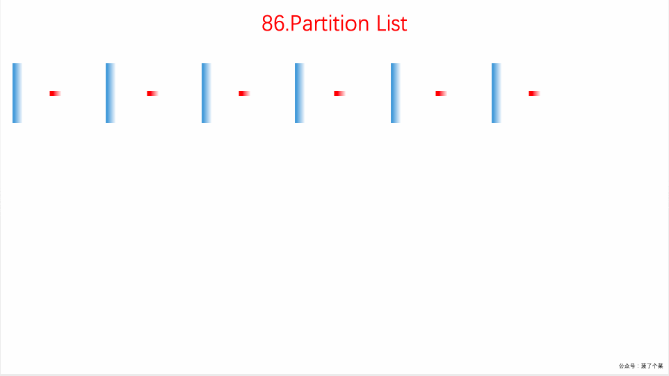

## 题目地址

https://leetcode.com/problems/partition-list/description/

## 题目描述

Given a linked list and a value x, partition it such that all nodes less than x come before nodes greater than or equal to x.

You should preserve the original relative order of the nodes in each of the two partitions.

Example:

Input: head = 1->4->3->2->5->2, x = 3
Output: 1->2->2->4->3->5

## 前置知识

- 链表

## 思路

- 设定两个虚拟节点，dummyHead1 用来保存小于该值的链表，dummyHead2 来保存大于等于该值的链表

- 遍历整个原始链表，将小于该值的放于 dummyHead1 中，其余的放置在 dummyHead2 中

遍历结束后，将 dummyHead2 插入到 dummyHead1 后面



(图片来自： https://github.com/MisterBooo/LeetCodeAnimation)

## 关键点解析

- 链表的基本操作（遍历）
- 虚拟节点 dummy 简化操作
- 遍历完成之后记得`currentL1.next = null;`否则会内存溢出

> 如果单纯的遍历是不需要上面操作的，但是我们的遍历会导致 currentL1.next 和 currentL2.next
> 中有且仅有一个不是 null， 如果不这么操作的话会导致两个链表成环，造成溢出。

## 代码

- 语言支持: Javascript，Python3

```js
/*
 * @lc app=leetcode id=86 lang=javascript
 *
 * [86] Partition List
 *
 * https://leetcode.com/problems/partition-list/description/
 *
 * algorithms
 * Medium (36.41%)
 * Total Accepted:    155.1K
 * Total Submissions: 425.1K
 * Testcase Example:  '[1,4,3,2,5,2]\n3'
 *
 * Given a linked list and a value x, partition it such that all nodes less
 * than x come before nodes greater than or equal to x.
 *
 * You should preserve the original relative order of the nodes in each of the
 * two partitions.
 *
 * Example:
 *
 *
 * Input: head = 1->4->3->2->5->2, x = 3
 * Output: 1->2->2->4->3->5
 *
 *
 */
/**
 * Definition for singly-linked list.
 * function ListNode(val) {
 *     this.val = val;
 *     this.next = null;
 * }
 */
/**
 * @param {ListNode} head
 * @param {number} x
 * @return {ListNode}
 */
var partition = function (head, x) {
  const dummyHead1 = {
    next: null,
  };
  const dummyHead2 = {
    next: null,
  };

  let current = {
    next: head,
  };
  let currentL1 = dummyHead1;
  let currentL2 = dummyHead2;
  while (current.next) {
    current = current.next;
    if (current.val < x) {
      currentL1.next = current;
      currentL1 = current;
    } else {
      currentL2.next = current;
      currentL2 = current;
    }
  }

  currentL2.next = null;

  currentL1.next = dummyHead2.next;

  return dummyHead1.next;
};
```

Python3 Code:

```python
class Solution:
    def partition(self, head: ListNode, x: int) -> ListNode:
        """在原链表操作，思路基本一致，只是通过指针进行区分而已"""
        # 在链表最前面设定一个初始node作为锚点，方便返回最后的结果
        first_node = ListNode(0)
        first_node.next = head
        # 设计三个指针，一个指向小于x的最后一个节点，即前后分离点
        # 一个指向当前遍历节点的前一个节点
        # 一个指向当前遍历的节点
        sep_node = first_node
        pre_node = first_node
        current_node = head

        while current_node is not None:
            if current_node.val < x:
                # 注意有可能出现前一个节点就是分离节点的情况
                if pre_node is sep_node:
                    pre_node = current_node
                    sep_node = current_node
                    current_node = current_node.next
                else:
                    # 这段次序比较烧脑
                    pre_node.next = current_node.next
                    current_node.next = sep_node.next
                    sep_node.next = current_node
                    sep_node = current_node
                    current_node = pre_node.next
            else:
                pre_node = current_node
                current_node = pre_node.next

        return first_node.next
```
