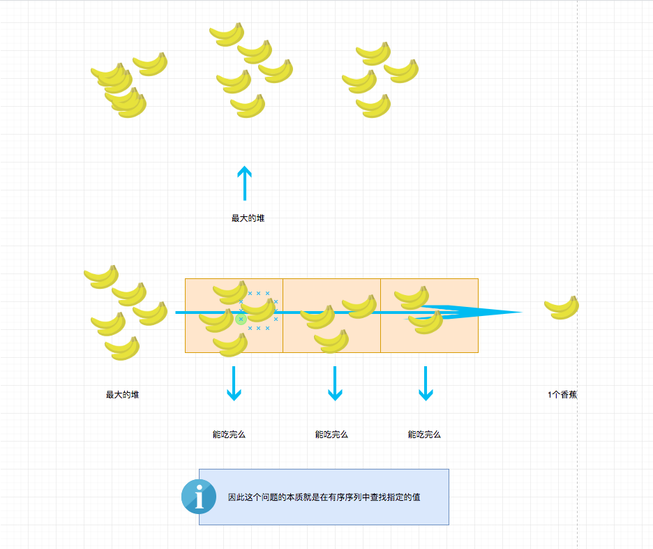

## 题目地址
https://leetcode.com/problems/koko-eating-bananas/description/

## 题目描述
```
Koko loves to eat bananas.  There are N piles of bananas, the i-th pile has piles[i] bananas.  The guards have gone and will come back in H hours.

Koko can decide her bananas-per-hour eating speed of K.  Each hour, she chooses some pile of bananas, and eats K bananas from that pile.  If the pile has less than K bananas, she eats all of them instead, and won't eat any more bananas during this hour.

Koko likes to eat slowly, but still wants to finish eating all the bananas before the guards come back.

Return the minimum integer K such that she can eat all the bananas within H hours.

 

Example 1:

Input: piles = [3,6,7,11], H = 8
Output: 4
Example 2:

Input: piles = [30,11,23,4,20], H = 5
Output: 30
Example 3:

Input: piles = [30,11,23,4,20], H = 6
Output: 23
 

Note:

1 <= piles.length <= 10^4
piles.length <= H <= 10^9
1 <= piles[i] <= 10^9

```

## 思路
符合直觉的做法是，选择最大的堆的香蕉数，然后试一下能不能行，如果不行则直接返回上次计算的结果，
如果行，我们减少1个香蕉，试试行不行，依次类推。计算出刚好不行的即可。这种解法的时间复杂度是O(n)。

这道题如果能看出来是二分法解决，那么其实很简单。为什么它是二分问题呢？
我这里画了个图，我相信你看了就明白了。



## 关键点解析

- 二分查找


## 代码

```js
/*
 * @lc app=leetcode id=875 lang=javascript
 *
 * [875] Koko Eating Bananas
 *
 * https://leetcode.com/problems/koko-eating-bananas/description/
 *
 * algorithms
 * Medium (44.51%)
 * Total Accepted:    11.3K
 * Total Submissions: 24.8K
 * Testcase Example:  '[3,6,7,11]\n8'
 *
 * Koko loves to eat bananas.  There are N piles of bananas, the i-th pile has
 * piles[i] bananas.  The guards have gone and will come back in H hours.
 * 
 * Koko can decide her bananas-per-hour eating speed of K.  Each hour, she
 * chooses some pile of bananas, and eats K bananas from that pile.  If the
 * pile has less than K bananas, she eats all of them instead, and won't eat
 * any more bananas during this hour.
 * 
 * Koko likes to eat slowly, but still wants to finish eating all the bananas
 * before the guards come back.
 * 
 * Return the minimum integer K such that she can eat all the bananas within H
 * hours.
 * 
 * 
 * 
 * 
 * 
 * 
 * 
 * Example 1:
 * 
 * 
 * Input: piles = [3,6,7,11], H = 8
 * Output: 4
 * 
 * 
 * 
 * Example 2:
 * 
 * 
 * Input: piles = [30,11,23,4,20], H = 5
 * Output: 30
 * 
 * 
 * 
 * Example 3:
 * 
 * 
 * Input: piles = [30,11,23,4,20], H = 6
 * Output: 23
 * 
 * 
 * 
 * 
 * Note:
 * 
 * 
 * 1 <= piles.length <= 10^4
 * piles.length <= H <= 10^9
 * 1 <= piles[i] <= 10^9
 * 
 * 
 * 
 * 
 * 
 */

 function canEatAllBananas(piles, H, mid) {
     let h = 0;
     for(let pile of piles) {
        h += Math.ceil(pile / mid);
     }

     return h <= H;
 }
/**
 * @param {number[]} piles
 * @param {number} H
 * @return {number}
 */
var minEatingSpeed = function(piles, H) {
    let lo = 1,
    hi = Math.max(...piles);

    while(lo <= hi) {
        let mid = lo + ((hi - lo) >> 1);
        if (canEatAllBananas(piles, H, mid)) {
            hi = mid - 1;
        } else {
            lo = mid + 1;
        }
    }

    return lo; //  不能选择hi
};
```

