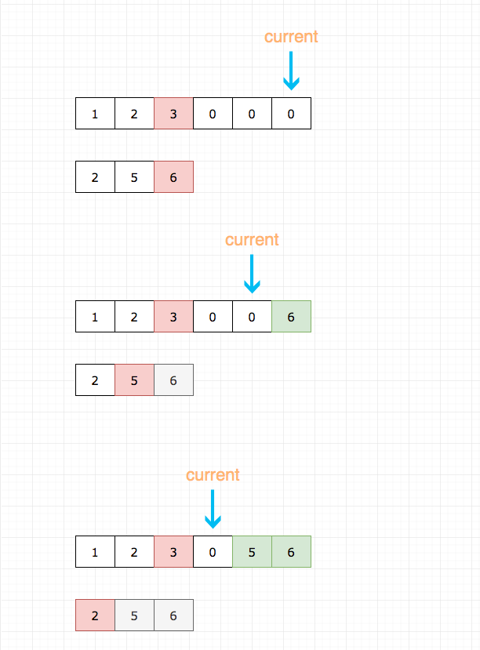
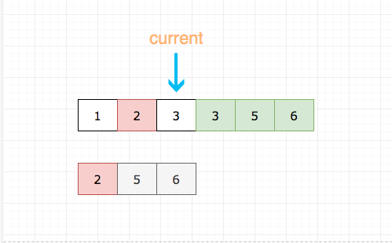
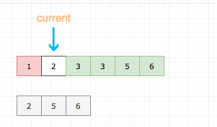

## 题目地址

https://leetcode.com/problems/merge-sorted-array/description/

## 题目描述

```
Given two sorted integer arrays nums1 and nums2, merge nums2 into nums1 as one sorted array.

Note:

The number of elements initialized in nums1 and nums2 are m and n respectively.
You may assume that nums1 has enough space (size that is greater or equal to m + n) to hold additional elements from nums2.
Example:

Input:
nums1 = [1,2,3,0,0,0], m = 3
nums2 = [2,5,6],       n = 3

Output: [1,2,2,3,5,6]
```

## 思路

符合直觉的做法是`将nums2插到num1的末尾, 然后排序`


具体代码：

```js
  // 这种解法连m都用不到
  // 这显然不是出题人的意思
  if (n === 0) return;
  let current2 = 0;
  for(let i = nums1.length - 1; i >= nums1.length - n ; i--) {
      nums1[i] = nums2[current2++];
  }
  nums1.sort((a, b) => a - b); // 当然你可以自己写排序，这里懒得写了，因为已经偏离了题目本身

```

这道题目其实和基本排序算法中的`merge sort`非常像，但是 merge sort 很多时候，合并的时候我们通常是
新建一个数组，这样就很简单。 但是这道题目要求的是`原地修改`.

这就和 merge sort 的 merge 过程有点不同，我们先来回顾一下 merge sort 的 merge 过程。

merge 的过程`可以`是先比较两个数组的头元素，然后将较小的推到最终的数组中，并将其从原数组中出队列。
循环直到两个数组都为空。

具体代码如下：

```js
// 将nums1 和 nums2 合并
function merge(nums1, nums2) {
  let ret = [];
  while (nums1.length || nums2.length) {
    // 为了方便大家理解，这里代码有点赘余
    if (nums1.length === 0) {
      ret.push(nums2.shift());
      continue;
    }

    if (nums2.length === 0) {
      ret.push(nums1.shift());
      continue;
    }
    const a = nums1[0];
    const b = nums2[0];
    if (a > b) {
      ret.push(nums2.shift());
    } else {
      ret.push(nums1.shift());
    }
  }
  return ret;
}
```

这里要求原地修改，其实我们能只要从后往前比较，并从后往前插入即可。

我们需要三个指针：

1. current 用于记录当前填补到那个位置了

2. m 用于记录 nums1 数组处理到哪个元素了

3. n 用于记录 nums2 数组处理到哪个元素了

如图所示：

- 灰色代表 num2 数组已经处理过的元素
- 红色代表当前正在进行比较的元素
- 绿色代表已经就位的元素





## 关键点解析

- 从后往前比较，并从后往前插入

## 代码

```js
/*
 * @lc app=leetcode id=88 lang=javascript
 *
 * [88] Merge Sorted Array
 *
 * https://leetcode.com/problems/merge-sorted-array/description/
 *
 * algorithms
 * Easy (34.95%)
 * Total Accepted:    347.5K
 * Total Submissions: 984.7K
 * Testcase Example:  '[1,2,3,0,0,0]\n3\n[2,5,6]\n3'
 *
 * Given two sorted integer arrays nums1 and nums2, merge nums2 into nums1 as
 * one sorted array.
 *
 * Note:
 *
 *
 * The number of elements initialized in nums1 and nums2 are m and n
 * respectively.
 * You may assume that nums1 has enough space (size that is greater or equal to
 * m + n) to hold additional elements from nums2.
 *
 *
 * Example:
 *
 *
 * Input:
 * nums1 = [1,2,3,0,0,0], m = 3
 * nums2 = [2,5,6],       n = 3
 *
 * Output: [1,2,2,3,5,6]
 *
 *
 */
/**
 * @param {number[]} nums1
 * @param {number} m
 * @param {number[]} nums2
 * @param {number} n
 * @return {void} Do not return anything, modify nums1 in-place instead.
 */
var merge = function(nums1, m, nums2, n) {
  // 设置一个指针，指针初始化指向nums1的末尾（根据#62，应该是index为 m+n-1 的位置，因为nums1的长度有可能更长）
  // 然后不断左移指针更新元素
  let current = m + n - 1;

  while (current >= 0) {
    // 没必要继续了
    if (n === 0) return;

    // 为了方便大家理解，这里代码有点赘余
    if (m < 1) {
      nums1[current--] = nums2[--n];
      continue;
    }

    if (n < 1) {
      nums1[current--] = nums1[--m];
      continue;
    }
    // 取大的填充 nums1的末尾
    // 然后更新 m 或者 n
    if (nums1[m - 1] > nums2[n - 1]) {
      nums1[current--] = nums1[--m];
    } else {
      nums1[current--] = nums2[--n];
    }
  }
};
```
模仿上述代码，思路相同
C++ code:
```
class Solution {
public:
    void merge(vector<int>& nums1, int m, vector<int>& nums2, int n) {
        int current = m + n - 1;
        while (current >= 0) {
            if (n == 0) return;
            if (m < 1) {
                nums1[current--] = nums2[--n];
                continue;
            }
            if (n < 1) {
                nums1[current--] = nums1[--m];
                continue;
            }
            if (nums1[m - 1] > nums2[n - 1]) nums1[current--] = nums1[--m];
            else nums1[current--] = nums2[--n];
        }
    }
};
```

Python 代码
```python
class Solution:
    def merge(self, nums1: List[int], m: int, nums2: List[int], n: int) -> None:
        """
        Do not return anything, modify nums1 in-place instead.
        """
        # 整体思路相似，只不过没有使用 current 指针记录当前填补位置
        while m > 0 and n > 0:
            if nums1[m-1] <= nums2[n-1]:
                nums1[m+n-1] = nums2[n-1]
                n -= 1
            else:
                nums1[m+n-1] = nums1[m-1]
                m -=1
        """
        由于没有使用 current，第一步比较结束后有两种情况:
            1. 指针 m>0，n=0，此时不需要做任何处理
            2. 指针 n>0，m=0，此时需要将 nums2 指针左侧元素全部拷贝到 nums1 的前 n 位
        """
        if n > 0:
            nums1[:n] = nums2[:n]
```
