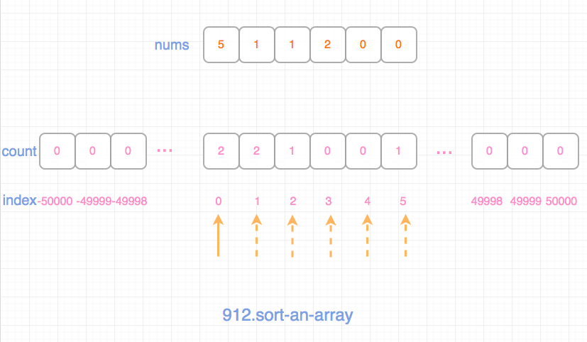

## 题目地址
https://leetcode.com/problems/sort-an-array/

## 题目描述
```
Given an array of integers nums, sort the array in ascending order.


Example 1:

Input: [5,2,3,1]
Output: [1,2,3,5]
Example 2:

Input: [5,1,1,2,0,0]
Output: [0,0,1,1,2,5]


Note:

1 <= A.length <= 10000
-50000 <= A[i] <= 50000
```

## 前置知识

- 数组
- 排序

## 思路

这是一个很少见的直接考察`排序`的题目。 其他题目一般都是暗含`排序`，这道题则简单粗暴，直接让你排序。
并且这道题目的难度是`Medium`， 笔者感觉有点不可思议。

我们先来看题目的限制条件，这其实在选择算法的过程中是重要的。 看到这道题的时候，大脑就闪现出了各种排序算法，
这也算是一个复习`排序算法`的机会吧。

题目的限制条件是有两个，第一是元素个数不超过10k，这个不算大。 另外一个是数组中的每一项范围都是`-50k`到`50k`（包含左右区间）。
看到这里，基本我就排除了时间复杂度为O(n^2)的算法。

> 我没有试时间复杂度 O(n^2) 的解法，大家可以试一下，看是不是会TLE。

剩下的就是基于比较的`nlogn`算法，以及基于特定条件的O(n)算法。

由于平时很少用到`计数排序`等O(n)的排序算法，一方面是空间复杂度不是常量，另一方面是其要求数据范围不是很大才行，不然会浪费很多空间。
但是这道题我感觉可以试一下。  在这里，我用了两种方法，一种是`计数排序`，一种是`快速排序`来解决。 大家也可以尝试用别的解法来解决。

### 解法一 - 计数排序

时间复杂度O(n)空间复杂度O(m) m 为数组中值的取值范围，在这道题就是`50000 * 2 + 1`。

我们只需要准备一个数组取值范围的数字，然后遍历一遍，将每一个元素放到这个数组对应位置就好了，
放的规则是`索引为数字的值，value为出现的次数`。

这样一次遍历，我们统计出了所有的数字出现的位置和次数。 我们再来一次遍历，将其输出到即可。




### 解法二 - 快速排序

快速排序和归并排序都是分支思想来进行排序的算法， 并且二者都非常流行。 快速排序的核心点在于选择轴元素。

每次我们将数组分成两部分，一部分是比pivot（轴元素）大的，另一部分是不比pivot大的。 我们不断重复这个过程，
直到问题的规模缩小的寻常（即只有一个元素的情况）。

快排的核心点在于如何选择轴元素，一般而言，选择轴元素有三种策略：

- 数组最左边的元素
- 数组最右边的元素
- 数组中间的元素（我采用的是这种，大家可以尝试下别的）
- 数组随机一项元素


(图片来自： https://www.geeksforgeeks.org/quick-sort/)

> 图片中的轴元素是最后面的元素，而提供的解法是中间元素，这点需要注意，但是这并不影响理解。


## 关键点解析

- 排序算法
- 注意题目的限制条件从而选择合适的算法


## 代码

计数排序：

代码支持： JavaScript
```js
/**
 * @param {number[]} nums
 * @return {number[]}
 */
var sortArray = function(nums) {
    const counts = Array(50000 * 2 + 1).fill(0);
    const res = [];
    for(const num of nums) counts[50000 + num] += 1;
    for(let i in counts)  {
        while(counts[i]--) {
            res.push(i - 50000)
        }
    }
    return res;
};
```


快速排序：

代码支持： JavaScript
```js
function swap(nums, a, b) {
    const temp = nums[a];
    nums[a] = nums[b];
    nums[b] = temp;
}

function helper(nums, start, end) {
    if (start >= end) return;
    const pivotIndex = start + ((end - start) >>> 1)
    const pivot = nums[pivotIndex]
    let i = start;
    let j = end;
    while (i <= j) {
        while (nums[i] < pivot) i++;
        while (nums[j] > pivot) j--;
        if (i <= j) {
            swap(nums, i, j);
            i++;
            j--;
        }
    }
    helper(nums, start, j);
    helper(nums, i, end);
}

/**
 * @param {number[]} nums
 * @return {number[]}
 */
var sortArray = function(nums) {
    helper(nums, 0, nums.length - 1);
    return nums;
};
```

## 扩展

- 你是否可以用其他方式排序算法解决

## 参考

- [QuickSort - geeksforgeeks](https://www.geeksforgeeks.org/quick-sort/)
