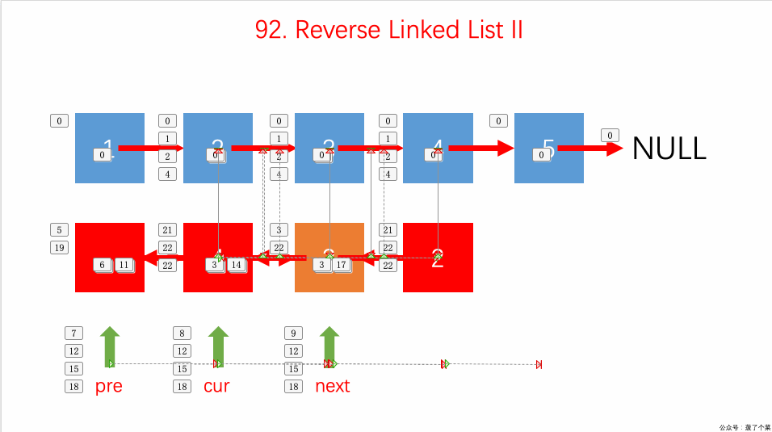

## 题目地址

https://leetcode.com/problems/reverse-linked-list-ii/description/

## 题目描述

Reverse a linked list from position m to n. Do it in one-pass.

Note: 1 ≤ m ≤ n ≤ length of list.

Example:

Input: 1->2->3->4->5->NULL, m = 2, n = 4
Output: 1->4->3->2->5->NULL

## 前置知识

- 链表

## 思路

这道题和[206.reverse-linked-list](https://github.com/azl397985856/leetcode/blob/master/problems/206.reverse-linked-list.md) 有点类似，并且这道题是 206 的升级版。 让我们反转某一个区间，而不是整个链表，我们可以将 206 看作本题的特殊情况（special case）。

核心在于**取出需要反转的这一小段链表，反转完后再插入到原先的链表中。**

以本题为例：

反转的是 2,3,4 这三个点，那么我们可以先取出 2，用 cur 指针指向 2，然后当取出 3 的时候，我们将 3 指向 2 的，把 cur 指针前移到 3，依次类推，到 4 后停止，这样我们得到一个新链表 4->3->2, cur 指针指向 4。

对于原链表来说，有两个点的位置很重要，需要用指针记录下来，分别是 1 和 5，把新链表插入的时候需要这两个点的位置。用 pre 指针记录 1 的位置当 4 结点被取走后，5 的位置需要记下来

这样我们就可以把反转后的那一小段链表加入到原链表中



(图片来自： https://github.com/MisterBooo/LeetCodeAnimation)

首先我们直接返回 head 是不行的。 当 m 不等于 1 的时候是没有问题的，但只要 m 为 1，就会有问题。

```python
class Solution:
    def reverseBetween(self, head: ListNode, m: int, n: int) -> ListNode:
        pre = None
        cur = head
        i = 0
        p1 = p2 = p3 = p4 = None
        # ...
        if p1:
            p1.next = p3
        else:
            dummy.next = p3
        if p2:
            p2.next = p4
        return head
```

如上代码是不可以的，我们考虑使用 dummy 节点。

```python
class Solution:
   def reverseBetween(self, head: ListNode, m: int, n: int) -> ListNode:
       pre = None
       cur = head
       i = 0
       p1 = p2 = p3 = p4 = None
       dummy = ListNode(0)
       dummy.next = head

       # ...

       if p1:
           p1.next = p3
       else:
           dummy.next = p3
       if p2:
           p2.next = p4

       return dummy.next
```

关于链表反转部分, 顺序比较重要，我们需要：

- 先 cur.next = pre
- 再 更新 p2 和 p2.next(其中要设置 p2.next = None，否则会互相应用，造成无限循环)
- 最后更新 pre 和 cur

上述的顺序不能错，不然会有问题。原因就在于`p2.next = None`，如果这个放在最后，那么我们的 cur 会提前断开。

```python
    while cur:
           i += 1
           if i == m - 1:
               p1 = cur
           next = cur.next
           if m < i <= n:
               cur.next = pre

           if i == m:
               p2 = cur
               p2.next = None

           if i == n:
               p3 = cur

           if i == n + 1:
               p4 = cur

           pre = cur
           cur = next
```

## 关键点解析

- 链表的基本操作
- 考虑特殊情况 m 是 1 或者 n 是链表长度的情况，我们可以采用虚拟节点 dummy 简化操作
- 用四个变量记录特殊节点， 然后操作这四个节点使之按照一定方式连接即可。
- 注意更新 current 和 pre 的位置， 否则有可能出现溢出

## 代码

语言支持：JS, C++, Python3

JavaScript Code:

```js
/*
 * @lc app=leetcode id=92 lang=javascript
 *
 * [92] Reverse Linked List II
 *
 * https://leetcode.com/problems/reverse-linked-list-ii/description/
 */
/**
 * Definition for singly-linked list.
 * function ListNode(val) {
 *     this.val = val;
 *     this.next = null;
 * }
 */
/**
 * @param {ListNode} head
 * @param {number} m
 * @param {number} n
 * @return {ListNode}
 */
var reverseBetween = function (head, m, n) {
  // 虚拟节点，简化操作
  const dummyHead = {
    next: head,
  };

  let cur = dummyHead.next; // 当前遍历的节点
  let pre = cur; // 因为要反转，因此我们需要记住前一个节点
  let index = 0; // 链表索引，用来判断是否是特殊位置（头尾位置）

  // 上面提到的四个特殊节点
  let p1 = (p2 = p3 = p4 = null);

  while (cur) {
    const next = cur.next;
    index++;

    // 对 (m - n) 范围内的节点进行反转
    if (index > m && index <= n) {
      cur.next = pre;
    }

    // 下面四个if都是边界, 用于更新四个特殊节点的值
    if (index === m - 1) {
      p1 = cur;
    }
    if (index === m) {
      p2 = cur;
    }

    if (index === n) {
      p3 = cur;
    }

    if (index === n + 1) {
      p4 = cur;
    }

    pre = cur;

    cur = next;
  }

  // 两个链表合并起来
  (p1 || dummyHead).next = p3; // 特殊情况需要考虑
  p2.next = p4;

  return dummyHead.next;
};
```

C++ Code:

```c++
/**
 * Definition for singly-linked list.
 * struct ListNode {
 *     int val;
 *     ListNode *next;
 *     ListNode(int x) : val(x), next(NULL) {}
 * };
 */
class Solution {
public:
    ListNode* reverseBetween(ListNode* head, int s, int e) {
        if (s == e) return head;
        ListNode* prev = nullptr;
        auto cur = head;
        for (int i = 1; i < s; ++i) {
            prev = cur;
            cur = cur->next;
        }
        // 此时各指针指向：
        // x -> x -> x -> x  -> 1 -> 2 -> 3 -> 4 -> 5 -> 6 -> 7 -> 8 -> x -> x -> x ->
        // ^head          ^prev ^cur
        ListNode* p = nullptr;
        auto c = cur;
        auto tail = c;
        ListNode* n = nullptr;
        for (int i = s; i <= e; ++i) {
            n = c->next;
            c->next = p;
            p = c;
            c = n;
        }
        // 此时各指针指向：
        // x -> x -> x -> x     8 -> 7 -> 6 -> 5 -> 4 -> 3 -> 2 -> 1     x -> x -> x ->
        // ^head          ^prev ^p                                 ^cur  ^c
        //                                                         ^tail
        if (prev != nullptr) { // 若指向前一个节点的指针不为空，则说明s在链表中间（不是头节点）
            prev->next = p;
            cur->next = c;
            return head;
        } else {
            if (tail != nullptr) tail->next = c;
            return p;
        }
    }
};
```

Python Code:

```Python
# Definition for singly-linked list.
# class ListNode:
#     def __init__(self, x):
#         self.val = x
#         self.next = None

class Solution:
    def reverseBetween(self, head: ListNode, m: int, n: int) -> ListNode:
        """采用先翻转中间部分，之后与不变的前后部分拼接的思路"""
        # 处理特殊情况
        if m == n:
            return head

        # 例行性的先放一个开始节点，方便操作
        first = ListNode(0)
        first.next = head

        # 通过以下两个节点记录拼接点
        before_m = first  # 原链表m前的部分
        after_n = None  # 原链表n后的部分

        # 通过以下两个节点记录翻转后的链表
        between_mn_head = None
        between_mn_end = None

        index = 0
        cur_node = first
        while index < n:
            index += 1
            cur_node = cur_node.next
            if index == m - 1:
                before_m = cur_node
            elif index == m:
                between_mn_end = ListNode(cur_node.val)
                between_mn_head = between_mn_end
            elif index > m:
                temp = between_mn_head
                between_mn_head = ListNode(cur_node.val)
                between_mn_head.next = temp
                if index == n:
                    after_n = cur_node.next

        # 进行拼接
        between_mn_end.next = after_n
        before_m.next = between_mn_head

        return first.next
```
