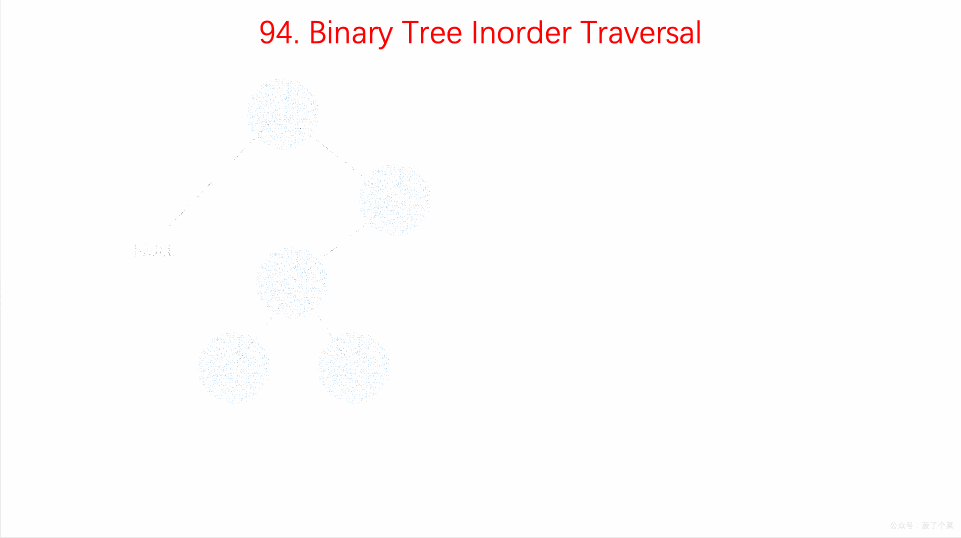

## 题目地址

https://leetcode.com/problems/binary-tree-inorder-traversal/description/

## 题目描述

```
Given a binary tree, return the inorder traversal of its nodes' values.

Example:

Input: [1,null,2,3]
   1
    \
     2
    /
   3

Output: [1,3,2]
Follow up: Recursive solution is trivial, could you do it iteratively?
```

## 前置知识

- 二叉树
- 递归

## 思路

递归的方式相对简单，非递归的方式借助栈这种数据结构实现起来会相对轻松。

如果采用非递归，可以用栈(Stack)的思路来处理问题。

中序遍历的顺序为左-根-右，具体算法为：

- 从根节点开始，先将根节点压入栈

- 然后再将其所有左子结点压入栈，取出栈顶节点，保存节点值

- 再将当前指针移到其右子节点上，若存在右子节点，则在下次循环时又可将其所有左子结点压入栈中， 重复上步骤



(图片来自： https://github.com/MisterBooo/LeetCodeAnimation)

## 关键点解析

- 二叉树的基本操作（遍历）
  > 不同的遍历算法差异还是蛮大的
- 如果非递归的话利用栈来简化操作

- 如果数据规模不大的话，建议使用递归

- 递归的问题需要注意两点，一个是终止条件，一个如何缩小规模

1. 终止条件，自然是当前这个元素是 null（链表也是一样）

2. 由于二叉树本身就是一个递归结构， 每次处理一个子树其实就是缩小了规模，
   难点在于如何合并结果，这里的合并结果其实就是`left.concat(mid).concat(right)`,
   mid 是一个具体的节点，left 和 right`递归求出即可`

## 代码

- 语言支持：JS，C++，Python3, Java

JavaScript Code：

```js
/*
 * @lc app=leetcode id=94 lang=javascript
 *
 * [94] Binary Tree Inorder Traversal
 *
 * https://leetcode.com/problems/binary-tree-inorder-traversal/description/
 *
 * algorithms
 * Medium (55.22%)
 * Total Accepted:    422.4K
 * Total Submissions: 762.1K
 * Testcase Example:  '[1,null,2,3]'
 *
 * Given a binary tree, return the inorder traversal of its nodes' values.
 *
 * Example:
 *
 *
 * Input: [1,null,2,3]
 * ⁠  1
 * ⁠   \
 * ⁠    2
 * ⁠   /
 * ⁠  3
 *
 * Output: [1,3,2]
 *
 * Follow up: Recursive solution is trivial, could you do it iteratively?
 *
 */
/**
 * Definition for a binary tree node.
 * function TreeNode(val) {
 *     this.val = val;
 *     this.left = this.right = null;
 * }
 */
/**
 * @param {TreeNode} root
 * @return {number[]}
 */
var inorderTraversal = function (root) {
  // 1. Recursive solution
  // if (!root) return [];
  // const left = root.left ? inorderTraversal(root.left) : [];
  // const right = root.right ? inorderTraversal(root.right) : [];
  // return left.concat([root.val]).concat(right);

  // 2. iterative solutuon
  if (!root) return [];
  const stack = [root];
  const ret = [];
  let left = root.left;

  let item = null; // stack 中弹出的当前项

  while (left) {
    stack.push(left);
    left = left.left;
  }

  while ((item = stack.pop())) {
    ret.push(item.val);
    let t = item.right;

    while (t) {
      stack.push(t);
      t = t.left;
    }
  }

  return ret;
};
```

C++ Code：

```c++
/**
 * Definition for a binary tree node.
 * struct TreeNode {
 *     int val;
 *     TreeNode *left;
 *     TreeNode *right;
 *     TreeNode(int x) : val(x), left(NULL), right(NULL) {}
 * };
 */
class Solution {
public:
    vector<int> inorderTraversal(TreeNode* root) {
        vector<TreeNode*> s;
        vector<int> v;
        while (root != NULL || !s.empty()) {
            for (; root != NULL; root = root->left)
                s.push_back(root);
            v.push_back(s.back()->val);
            root = s.back()->right;
            s.pop_back();
        }
        return v;
    }
};
```

Python Code:

```Python
# Definition for a binary tree node.
# class TreeNode:
#     def __init__(self, x):
#         self.val = x
#         self.left = None
#         self.right = None

class Solution:
    def inorderTraversal(self, root: TreeNode) -> List[int]:
        """
        1. 递归法可以一行代码完成，无需讨论；
        2. 迭代法一般需要通过一个栈保存节点顺序，我们这里直接使用列表
          - 首先，我要按照中序遍历的顺序存入栈，这边用的逆序，方便从尾部开始处理
          - 在存入栈时加入一个是否需要深化的参数
          - 在回头取值时，这个参数应该是否，即直接取值
          - 简单调整顺序，即可实现前序和后序遍历
        """
        # 递归法
        # if root is None:
        #     return []
        # return self.inorderTraversal(root.left)\
        #     + [root.val]\
        #     + self.inorderTraversal(root.right)
        # 迭代法
        result = []
        stack = [(1, root)]
        while stack:
            go_deeper, node = stack.pop()
            if node is None:
                continue
            if go_deeper:
                # 左右节点还需继续深化，并且入栈是先右后左
                stack.append((1, node.right))
                # 节点自身已遍历，回头可以直接取值
                stack.append((0, node))
                stack.append((1, node.left))
            else:
                result.append(node.val)
        return result
```

Java Code:

- recursion

```java
/**
 * Definition for a binary tree node.
 * public class TreeNode {
 *     int val;
 *     TreeNode left;
 *     TreeNode right;
 *     TreeNode(int x) { val = x; }
 * }
 */
class Solution {
    List<Integer> res = new LinkedList<>();
    public List<Integer> inorderTraversal(TreeNode root) {
        inorder(root);
        return res;
    }

    public void inorder (TreeNode root) {
        if (root == null) return;

        inorder(root.left);

        res.add(root.val);

        inorder(root.right);
    }
}
```

- iteration

```java
/**
 * Definition for a binary tree node.
 * public class TreeNode {
 *     int val;
 *     TreeNode left;
 *     TreeNode right;
 *     TreeNode(int x) { val = x; }
 * }
 */
class Solution {
    public List<Integer> inorderTraversal(TreeNode root) {
        List<Integer> res = new ArrayList<> ();
        Stack<TreeNode> stack = new Stack<> ();

        while (root != null || !stack.isEmpty()) {
            while (root != null) {
                stack.push(root);
                root = root.left;
            }
            root = stack.pop();
            res.add(root.val);
            root = root.right;
        }
        return res;
    }
}
```
