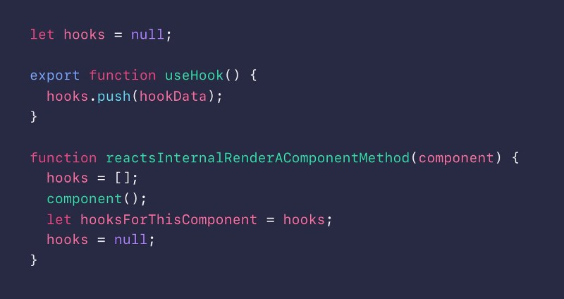
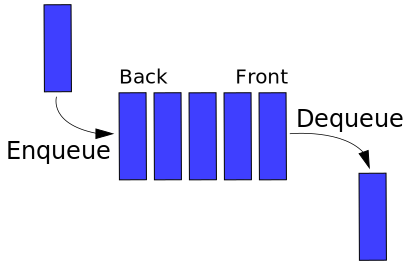
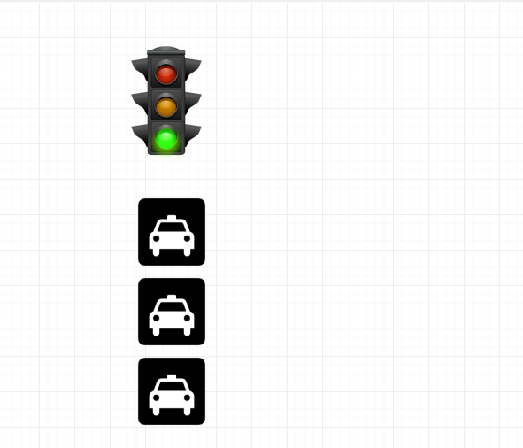
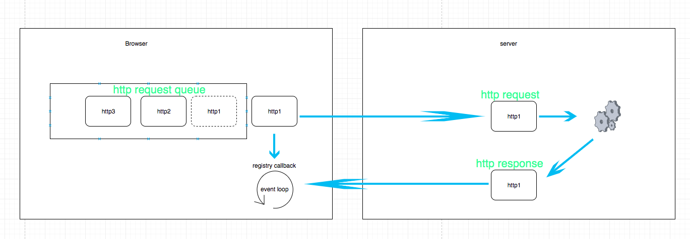
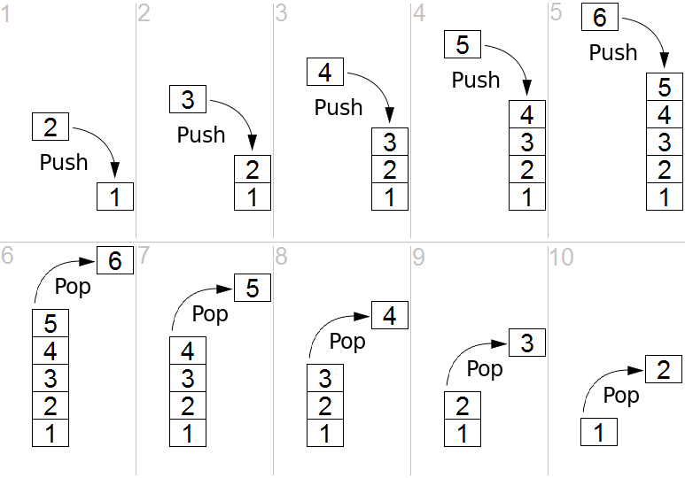
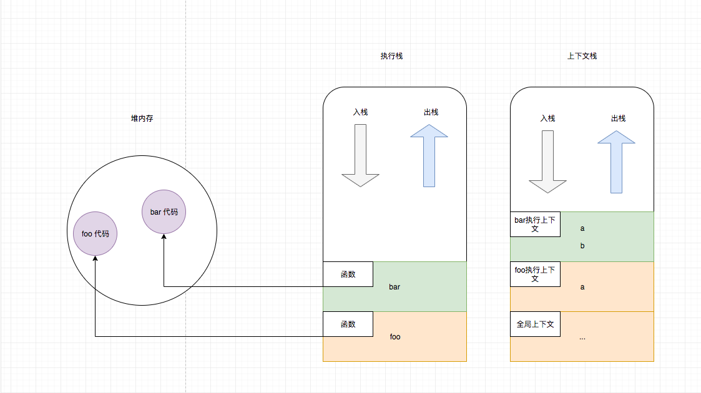
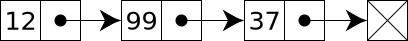
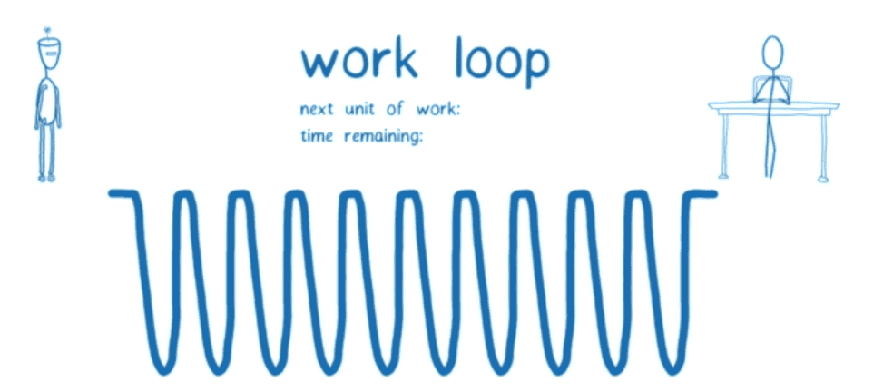

# Basic data structure

> WIP: the translation of `basic data structure` is on the way.

This article is not going to intepret data structures, but help you to `review and understand` data structures and algorithms with real scenes. So, if you have a poor data structure foundation, you'd better to read some basic courses about data structures before reading this.

This article is focused on frontend. We are expected to enhance your understanding to data structures from how data structures are implemented in frontend.

## Linear structure

Data structures can be divided into linear and non-linear structures logically.  
The linear structure contains array, stack, linked list and so on.  
The non-linear structure contains tree, graph and so on.

> In fact, tree can be taken for a half-linear structure.

It should be noted that, the linear and non-linear date structures do NOT mean that the data in those structure are stored in a linear or non-linear on the hard disk. It is just a logic partition. For example, binary tree can be stored in array.

Generally speaking, the data structure which has `pre` and `next` is linear.
Such as Array and Linked List, actually the Linked List is  a kind of `Single Tree`。
### Array

Array is the simplest data structure and is used in so many places. For example, array is perfectly appropriate to store a data list. And in fact, you can find array behind many other data structures.

The stack and queue structures which will be mentioned later can be regarded as a kind of LIMITED array. You can find the detials in the corresponding sections.

Now, let's have a look at some interesting examples.

#### React Hooks

`hooks` is essentially an array.



So, why `hooks` uses array? Maybe we can find the answer from the other side. What if not array?

```js

function Form() {
  // 1. Use the name state variable
  const [name, setName] = useState('Mary');

  // 2. Use an effect for persisting the form
  useEffect(function persistForm() {
    localStorage.setItem('formData', name);
  });

  // 3. Use the surname state variable
  const [surname, setSurname] = useState('Poppins');

  // 4. Use an effect for updating the title
  useEffect(function updateTitle() {
    document.title = name + ' ' + surname;
  });

  // ...
}
```

基于数组的方式，`Form`的hooks就是 [hook1, hook2, hook3, hook4],
我们可以得出这样的关系， hook1就是[name, setName] 这一对，
hook2就是persistForm这个。

如果不用数组实现，比如对象，Form的hooks就是
```js
{
  'key1': hook1,
  'key2': hook2,
  'key3': hook3,
  'key4': hook4,
}
```
那么问题是key1，key2，key3，key4怎么取呢？

关于React hooks 的本质研究，更多请查看[React hooks: not magic, just arrays](https://medium.com/@ryardley/react-hooks-not-magic-just-arrays-cd4f1857236e)

React 将`如何确保组件内部hooks保存的状态之间的对应关系`这个工作交给了 
开发人员去保证，即你必须保证HOOKS的顺序严格一致，具体可以看React 官网关于 Hooks Rule 部分。

### Queue

Queue is a limited sequence. The elements in queue can only be removed from the head and only be added from the tail.

> accoding to FIFO(fisrt-in-first-out) principle

Queue is also a very common data structure with widespread application. Like message queue.

> The queue in data structure is just like the queue in daily life.

In IT area, a queue is a specific ADT(abstract data type) or set. The entities in the set are stored in a certain sequence.

There are twe basic operations of queue:

- Adding entity to the tail, which is called enqueue.
- Removing entity from the head, which is called dequeue.

Explaining of FIFO:



(picture source: https://github.com/trekhleb/javascript-algorithms/blob/master/src/data-structures/queue/README.zh-CN.md)

There is a problem, Head of Line Block (HOL), in HTTP/1.1. What is that? And how HTTP/2 solves the problem?

In fact, the HOL are not only appearing in HTTP/1.1, but also in switcher. The key to this problem is queue structure.

For the same TCP connection, all HTTP/1.0 requests will be add into a queue. Which means, the next request can be sent until the previous respond has been received. This block happens at the client side mostly.

Just like waiting the traffic lights, if you are on the left-turn or right-turning lane, you cannot move even if the straight lane is good to go when the left/right turning light is still red.



`HTTP/1.0` and `HTTP/1.1`:  
Accoding to `HTTP/1.0` protocal, one TCP connect will be established for each request and be terminated immediately after receiving the corresponding response. And the next HTTP request cannot be sent until the response of previous request has been received.  
According to `HTTP/1.1`, each connection is persistent connection by default. For the same TCP connection, it is allowed to send multiple `HTTP/1.1` request at the same time. In other words, it is unnecessary to send the next request after receiving the response of the previous one. This is the solution to the HOL bloking of `HTTP/1.0`. And, this is called `pipeline` in `HTTP/1.1`.  
However, according to `HTTP/1.1`， all the responses are reqired to be sent back to client or brower in the sequence of that being received. In other words, one request received in front should be responded in front. The HOL blocking will happend when one request in front takes a long processing time. All later request have to wait for it. So, the HOL blocking of `HTTP/1.1` happends at the server side.

The process can be represented as follow:



### Stack

Stack is a kind of limited sequence. It only supports to add or remove element at the **top** of stack.

In IT area, a stack is an ADT (abstract data type) for representing a set of elements. 

There are basic operations of stack:

- Adding element at the top (tail), which called `push`
- Removing the element at the top (tail), which called `pop`

The two operations can be summarized as LIFO (last-in-first-out) or FILO (first-in-last-out)

Besides, there is usually an operation called `peek` which is used to retrieve the first element of the stack or the element present at the top of the stack. Compared with `pop`, the `peek` operation won't remove the retrieved element from the stack.

> Stack can be regarded as a pile of books or dishes.

Explaining of `push` and `pop` operations:



(Picture from: https://github.com/trekhleb/javascript-algorithms/blob/master/src/data-structures/stack/README.zh-CN.md)

Stack has been used in many places and areas. For example, in browser, the Execution Stack is a basic stack structure.  
So, the recursion and loop+stack are essentially the same thing.

For example:

```js
function bar() {
  const a = 1
  const b = 2;
  console.log(a, b)
}
function foo() {
  const a = 1;
  bar();
}

foo();


```

It may look like this inside the program during executing:



> The figure above does not contains the other parts of the execution context, like `this` and `scope` which are the key to closure. Here is not going to talk about the closure but to explain the stack structure.
> Some statements in community like *the `scope` of execution context is the variables which declared by the super class in execution stack* which are completely wrong. JS uses Lexical Scoping. And `scope` is the parent object of function when it is defined. There is nothing to do with the execution.

The common use of stack including Base Conversion, bracket matching, stack shuffling, Infix Expression and Postfix Expression, etc.

> There is a correspongding relationship between legal stack shuffling operations and legal bracket matching expressions.
> In another word, the number of conditions of Stack Shuffling with `n` elements equals the number of conditions of legal expressions of `n` pairs of brackets.

### Linked List

Linked List is the most basic data structure. So, it is quit important to make yourself master of understanding and using Linked List.



(Picture from: https://github.com/trekhleb/javascript-algorithms/tree/master/src/algorithms/linked-list/traversal)

#### React Fiber

Many people know that `fiber` is implemented on Linked List. But not many of them know the reason. So, let's have a look at the relationship between `fiber` and Linked list.

The appearance of `fiber` solves the problem that `react` must
fiber 出现的目的其实是为了解决 react 在执行的时候是无法停下来的，需要一口气执行完的问题的。



图片来自 Lin Clark 在 ReactConf 2017 分享

上面已经指出了引入 fiber 之前的问题，就是 react 会阻止优先级高的代码（比如用户输入）执行。因此 fiber
打算自己自建一个`虚拟执行栈`来解决这个问题，这个虚拟执行栈的实现是链表。

Fiber 的基本原理是将协调过程分成小块，一次执行一块，然乎将运算结果保存起来，并判断是否有时间（react 自己实现了一个类似 requestIdleCallback 的功能）继续执行下一块。
如果有时间，则继续。 否则跳出，让浏览器主线程歇一会，执行别的优先级高的代码。

当协调过程完成（所有的小块都运算完毕）， 那么就会进入提交阶段， 真正的进行副作用（side effect）操作，比如更新DOM，这个过程是没有办法取消的，原因就是这部分有副作用。

问题的关键就是将协调的过程划分为一块块的，最后还可以合并到一起，有点像Map／Reduce。

React 必须重新实现遍历树的算法，从依赖于`内置堆栈的同步递归模型`，变为`具有链表和指针的异步模型`。

> Andrew 是这么说的： 如果你只依赖于[内置]调用堆栈，它将继续工作直到堆栈为空。。。

如果我们可以随意中断调用堆栈并手动操作堆栈帧，那不是很好吗？
这就是 React Fiber 的目的。 `Fiber 是堆栈的重新实现，专门用于 React 组件`。 你可以将单个 Fiber 视为一个`虚拟堆栈帧`。

react fiber 大概是这样的：

```js
let fiber = {
  tag: HOST_COMPONENT,
  type: "div",
  return: parentFiber,
  children: childFiber,
  sibling: childFiber,
  alternate: currentFiber,
  stateNode: document.createElement("div"),
  props: { children: [], className: "foo"},
  partialState: null,
  effectTag: PLACEMENT,
  effects: []
};

```

从这里可以看出fiber本质上是个对象，使用parent，child，sibling属性去构建fiber树来表示组件的结构树，
return, children, sibling也都是一个fiber，因此fiber看起来就是一个链表。

> 细心的朋友可能已经发现了， alternate也是一个fiber， 那么它是用来做什么的呢？
它其实原理有点像git， 可以用来执行git revert ,git commit等操作，这部分挺有意思，我会在我的《从零开发git》中讲解 

想要了解更多的朋友可以看[这个文章](https://github.com/dawn-plex/translate/blob/master/articles/the-how-and-why-on-reacts-usage-of-linked-list-in-fiber-to-walk-the-components-tree.md)

如果可以翻墙， 可以看[英文原文](https://medium.com/react-in-depth/the-how-and-why-on-reacts-usage-of-linked-list-in-fiber-67f1014d0eb7)

[这篇文章](https://engineering.hexacta.com/didact-fiber-incremental-reconciliation-b2fe028dcaec)也是早期讲述fiber架构的优秀文章

我目前也在写关于《从零开发react系列教程》中关于fiber架构的部分，如果你对具体实现感兴趣，欢迎关注。

## Non-linear Structure

The reason that we need non-linear structures is satisfying both of static operations and dynamic operations.

### Tree

The Tree structure is also used widely. From file system to the Internet, the organizational structure of many of them can be represented as tree structure.
The DOM (document object model) in frontend is also a tree structure. And `HTML` is a implementation of DSL (domain specific language) to describe this tree structure.

In fact, Tree is one kind of graph. It is an acyclic connected graph, a maximal acyclic graph and a minimal connected graph.

From another prespective, Tree is a recursive data structure. [Left-Child Right-Sibling Representation of Tree](https://www.geeksforgeeks.org/left-child-right-sibling-representation-tree/) can be used to help to understand the structure of Tree.

The basic operations of Tree including preoder, inorder, postoder and hierarchical traversals.  
It is very easy to distinguish preorder, inorder and postorder traversals:
  
- the preorder, inorder and postorder refer to the position of root during traversal.
- the two children nodes are always traversed from left to right.
- preorder: `root` -> `left child` -> `right child` (recursive).
- inorder: `left child` -> `root` -> `right child` (recursive).
- postorder: `left child` -> `right child` -> `root` (recursive)

Because Tree is a recursive data structure, it is very easy to complete tree traversal using recursion.  
Basically, the algorithms of Tree are all based on the tree traversal. But the performance of recursion is always a problem.  
So, it may be helpful with understanding and using *imperative iteration* traversal algorithms.

Stack can be used to implement the iterative traversal with using less code.

> If stack is used, make sure that the left and right children are pushed into stack in correct sequence.

Important properties of Tree:

- If a tree has `n` vertex, then it has `n-1` edges.
- There is only one path between any node and the root node. The length of this path is called the depth of the node.

### Binary Tree

Binary tree is the tree that the degree of each node is not more than 2. It is a special subset of tree.
It is interesting that the binary tree which is a kind of limited tree can be used to represent and implemented all tree structures.  
The principle behind Binary Tree is the `Left-Child Right-Sibling Representation of Tree`. 

> Binary Tree is a paticular case of multiple-way tree. But when Binary Tree has root and is ordered, it can be used to describe the latter.
>
> In fact, just rotating the tree 45 degrees, you can get a tree represented by `Left-Child Right-Sibling`

Related algorithms:

- [94.binary-tree-inorder-traversal](../problems/94.binary-tree-inorder-traversal.md)
- [102.binary-tree-level-order-traversal](../problems/102.binary-tree-level-order-traversal.md)
- [103.binary-tree-zigzag-level-order-traversal](../problems/103.binary-tree-zigzag-level-order-traversal.md)
- [144.binary-tree-preorder-traversal](../problems/144.binary-tree-preorder-traversal.md)
- [145.binary-tree-postorder-traversal](../problems/145.binary-tree-postorder-traversal.md)
- [199.binary-tree-right-side-view](../problems/199.binary-tree-right-side-view.md)

Related concepts:

- Proper Binary Tree (all node degrees can only be even, that is 0 or 2)

BTW, you can find more details and algorithms in the charpter [binary tree traversal](./binary-tree-traversal.md)

#### Heap

Heap is a kind of priority queue which is built in many data structure. But unfortunately, JS does not have a native implementation of this data structure. However, it won't be a problem for understanding and using this structure.

Note that: heap is not the only implementation of `priority queue`, there're a lot of more complex
implementations

Related algorithm:

- [295.find-median-from-data-stream](../problems/295.find-median-from-data-stream.md)

#### Binary Search Tree

### Balanced Tree

database engine

#### AVL Tree

#### Red-Black Tree

### Trie(Prefix Tree)

Related algorithm:

- [208.implement-trie-prefix-tree](../problems/208.implement-trie-prefix-tree.md)

### Graph
