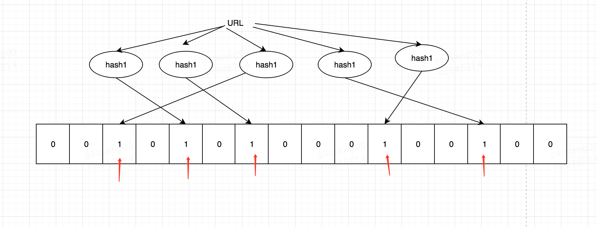

## 场景
假设你现在要处理这样一个问题，你有一个网站并且拥有`很多`访客，每当有用户访问时，你想知道这个ip是不是第一次访问你的网站。

### hashtable 可以么
一个显而易见的答案是将所有的ip用hashtable存起来，每次访问都去hashtable中取，然后判断即可。但是题目说了网站有`很多`访客，
假如有10亿个用户访问过，每个ip的长度是4 byte，那么你一共需要4 * 1000000000 = 4000000000Bytes = 4G , 如果是判断URL黑名单，
由于每个URL会更长，那么需要的空间可能会远远大于你的期望。

### bit
另一个稍微难想到的解法是bit， 我们知道bit有0和1两种状态，那么用来表示存在，不存在再合适不过了。

加入有10亿个ip，我们就可以用10亿个bit来存储，那么你一共需要 1 * 1000000000 = (4000000000 / 8) Bytes = 128M, 变为原来的1/32,
如果是存储URL这种更长的字符串，效率会更高。 

基于这种想法，我们只需要两个操作，set(ip) 和 has(ip)

这样做有两个非常致命的缺点：

1. 当样本分布极度不均匀的时候，会造成很大空间上的浪费

> 我们可以通过散列函数来解决

2. 当元素不是整型（比如URL）的时候，BitSet就不适用了

> 我们还是可以使用散列函数来解决， 甚至可以多hash几次

### 布隆过滤器

布隆过滤器其实就是`bit + 多个散列函数`,  如果经过多次散列的值再bit上都为1，那么可能存在(可能有冲突)。 如果
有一个不为1，那么一定不存在（一个值经过散列函数得到的值一定是唯一的），这也是布隆过滤器的一个重要特点。

### 布隆过滤器的应用

1. 网络爬虫
判断某个URL是否已经被爬取过

2. K-V数据库 判断某个key是否存在

比如Hbase的每个Region中都包含一个BloomFilter，用于在查询时快速判断某个key在该region中是否存在。

3. 钓鱼网站识别

浏览器有时候会警告用户，访问的网站很可能是钓鱼网站，用的就是这种技术

> 从这个算法大家可以对 tradeoff(取舍) 有更入的理解。

