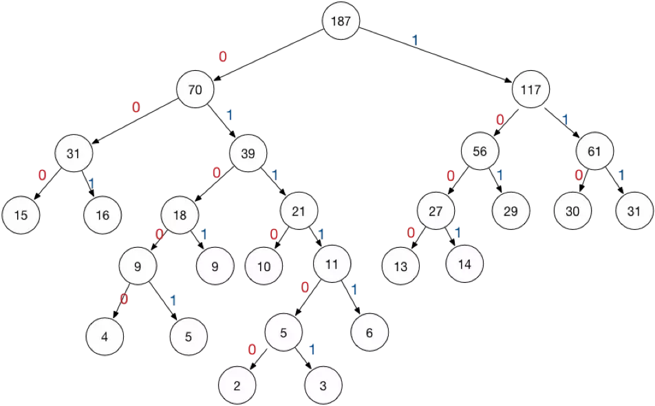
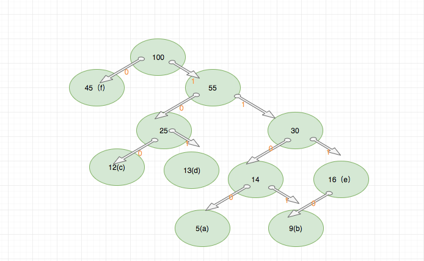

# 游程编码和哈夫曼编码

## Huffman encode(哈夫曼编码)

Huffman 编码的基本思想就是用短的编码表示出现频率高的字符，用长的编码来表示出现频率低的字符，这使得编码之后的字符串的平均长度、长度的期望值降低，从而实现压缩的目的。
因此 Huffman 编码被广泛地应用于无损压缩领域。

Huffman 编码的过程包含两个主要部分：

- 根据输入字符构建 Huffman 树
- 遍历 Huffman 树，并将树的节点分配给字符

上面提到了他的基本原理就是`用短的编码表示出现频率高的字符，用长的编码来表示出现频率低的字符`,
因此首先要做的就是统计字符的出现频率，然后根据统计的频率来构建 Huffman 树（又叫最优二叉树）。



Huffman 树就像是一个堆。真正执行编码的时候，类似字典树，节点不用来编码，节点的路径用来编码.

> 节点的值只是用来构建 Huffman 树

eg:

我们统计的结果如下：

|character|frequency|
|:--:|:--:|
|a|5|
|b|9|
|c|12|
|d|13|
|e|16|
|f|45|

- 将每个元素构造成一个节点，即只有一个元素的树。并构建一个最小堆，包含所有的节点，该算法用了最小堆来作为优先队列。

- `选取两个权值最小的节点`，并添加一个权值为5+9=14的节点，作为他们的父节点。并`更新最小堆`，现在最小堆包含5个节点，其中4个树还是原来的节点，权值为5和9的节点合并为一个。

结果是这样的：



|character|frequency|encoding|
|:-:|:-:|:-:|
|a|5|1100|
|b|9|1110|
|c|12|100|
|d|13|101|
|e|16|111|
|f|45|0|

## run-length encode(游程编码)

游程编码是一种比较简单的压缩算法，其基本思想是将重复且连续出现多次的字符使用（连续出现次数，某个字符）来描述。

比如一个字符串：

```text
AAAAABBBBCCC
```

使用游程编码可以将其描述为：

```text
5A4B3C
```

5A表示这个地方有5个连续的A，同理4B表示有4个连续的B，3C表示有3个连续的C，其它情况以此类推。

但是实际上情况可能会非常复杂， 如何提取子序列有时候没有看的那么简单，还是上面的例子，我们
有时候可以把`AAAAABBBBCCC`整体看成一个子序列， 更复杂的情况还有很多，这里不做扩展。

对文件进行压缩比较适合的情况是文件内的二进制有大量的连续重复，
一个经典的例子就是具有大面积色块的BMP图像，BMP因为没有压缩，
所以看到的是什么样子存储的时候二进制就是什么样子

> 这也是我们图片倾向于纯色的时候，压缩会有很好的效果

> 思考一个问题， 如果我们在CDN上存储两个图片，这两个图片几乎完全一样，我们是否可以进行优化呢？
这虽然是CDN厂商更应该关心的问题，但是这个问题对我们影响依然很大，值得思考

## 总结

实际情况，我们先用游程编码一遍，然后再用 Huffman 再次编码一次。

## 相关题目

[900.rle-iterator](../problems/900.rle-iterator.md)